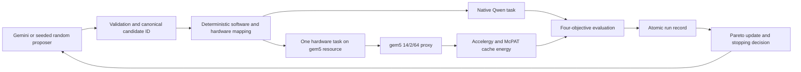

# CHIA Qwen hardware/software co-design

This repository contains a bounded CHIA loop for comparing Gemini-guided and
seeded-random search over one shared hardware/software design space. This guide
installs and runs the complete project on **one Ubuntu server**: the controller,
Ray resources, native Qwen service, gem5 proxy, cache-energy estimator,
evaluation, Pareto logic, and evidence writer.

> **Release gate:** do not run a pilot or burst until configuration validation,
> the release preflight, and the one-candidate smoke all pass on the target
> server. A full burst is never started automatically by this repository.

## Locked experiment profile

| Item | Release value |
| --- | --- |
| Native model | Qwen2.5-0.5B-Instruct Q5_K_M |
| Model file | `/opt/chia/models/qwen2.5-0.5b-instruct-q5_k_m.gguf` |
| Model SHA-256 | `041474553fcabfc2a2d67903f9d2c2e50bd92528e670da4f33b5d0ce6e59fd55` |
| Dataset | Repository OpenStax questions only |
| Proxy | packed-Q4 attention, 14 query heads / 2 KV heads / 64 head dimension |
| gem5 image | `ghcr.io/gem5/devcontainer:v25-1` |
| Energy image | `chia-energy-tools:0.3` |
| Objectives | native latency, proxy simulated time, estimated cache dynamic energy, quality loss |
| Campaign contract | `experiment-contracts/campaigns/final-burst.yaml` |

The 14/2/64 proxy represents Qwen attention geometry for comparative hardware
design-space exploration. Its validation supports context-scaling trend
fidelity, not absolute full-model latency equivalence. gem5 does not simulate
the entire Qwen model.

The energy objective covers dynamic access energy for two L1 instruction
caches, two L1 data caches, and one shared L2 cache. It excludes processor-core
logic, DRAM, interconnect, TLBs, static/leakage energy, and native Qwen energy.

## Single-server execution flow



One Ray node advertises `control`, `llama_cpp`, and `gem5`. gem5 and energy run
sequentially inside the same hardware task and share one total hardware
deadline. The controller is the only authoritative run-record writer.

## 1. Server requirements

The release is designed for Linux x86-64 and has been prepared around Ubuntu
24.04. A practical starting point is at least 8 logical CPU threads, 16 GiB RAM,
and 40 GiB free disk. These are deployment recommendations, not measured
performance guarantees.

Install the host tools:

```bash
sudo apt-get update
sudo apt-get install -y \
  build-essential \
  ca-certificates \
  cmake \
  curl \
  docker.io \
  git \
  libssl-dev \
  ninja-build \
  python3 \
  python3-venv

sudo systemctl enable --now docker
sudo usermod -aG docker "$USER"
```

Log out and back in after adding the Docker group, then verify:

```bash
docker version
git --version
cmake --version
```

Install `uv` for the operator account:

```bash
curl -LsSf https://astral.sh/uv/install.sh | sh
source "$HOME/.local/bin/env"
uv --version
```

## 2. Clone the project and install Python dependencies

After the release PR is merged, use `main`. To test the release branch before
merge, set `CHIA_REF=release/final-burst` before this block.

```bash
export CHIA_REF="${CHIA_REF:-main}"
export CHIA_ROOT=/opt/chia
export CHIA_REPO="$CHIA_ROOT/CHIA-Project"

sudo install -d -m 0755 -o "$USER" -g "$USER" "$CHIA_ROOT"
git clone --branch "$CHIA_REF" \
  https://github.com/SocialLab-AI/CHIA-Project.git \
  "$CHIA_REPO"

cd "$CHIA_REPO"
uv python install 3.10
uv sync --frozen --python 3.10 --extra dev --extra cluster --extra calibration
source .venv/bin/activate

python --version
ray --version
uv --version
```

For an existing checkout:

```bash
cd /opt/chia/CHIA-Project
git fetch --prune origin
git switch main
git pull --ff-only origin main
uv sync --frozen --python 3.10 --extra dev --extra cluster --extra calibration
source .venv/bin/activate
```

## 3. Install and verify the model

The official Qwen GGUF repository publishes the required Q5_K_M file. The
campaign refuses a model whose content hash differs from the reviewed value.

```bash
export MODEL_NAME=qwen2.5-0.5b-instruct-q5_k_m.gguf
export MODEL_PATH="/opt/chia/models/$MODEL_NAME"
export MODEL_SHA256=041474553fcabfc2a2d67903f9d2c2e50bd92528e670da4f33b5d0ce6e59fd55
export MODEL_URL="https://huggingface.co/Qwen/Qwen2.5-0.5B-Instruct-GGUF/resolve/main/$MODEL_NAME?download=true"

curl --fail --location --retry 3 \
  --output "/tmp/$MODEL_NAME" \
  "$MODEL_URL"

printf '%s  %s\n' "$MODEL_SHA256" "/tmp/$MODEL_NAME" | sha256sum --check -

sudo install -d -m 0755 /opt/chia/models
sudo install -m 0644 "/tmp/$MODEL_NAME" "$MODEL_PATH"
printf '%s  %s\n' "$MODEL_SHA256" "$MODEL_PATH" | sha256sum --check -
```

## 4. Build and install llama.cpp

The ref below matches the runtime build used during release preparation. The
complete `build/bin` directory is installed because `llama-server` depends on
the shared libraries built beside it.

```bash
export LLAMA_CPP_REF=543158132
export LLAMA_SRC="$HOME/.cache/chia/llama.cpp"

mkdir -p "$HOME/.cache/chia"
if [ ! -d "$LLAMA_SRC/.git" ]; then
  git clone https://github.com/ggml-org/llama.cpp.git "$LLAMA_SRC"
fi

git -C "$LLAMA_SRC" fetch --tags --prune
git -C "$LLAMA_SRC" checkout --detach "$LLAMA_CPP_REF"

cmake -S "$LLAMA_SRC" -B "$LLAMA_SRC/build-chia" \
  -G Ninja \
  -DCMAKE_BUILD_TYPE=Release \
  -DGGML_NATIVE=ON
cmake --build "$LLAMA_SRC/build-chia" \
  --target llama-server \
  --parallel "$(nproc)"

sudo install -d -m 0755 /opt/chia/llama.cpp/bin
sudo cp -a "$LLAMA_SRC/build-chia/bin/." /opt/chia/llama.cpp/bin/
sudo chown -R root:root /opt/chia/llama.cpp
sudo chmod 0755 /opt/chia/llama.cpp /opt/chia/llama.cpp/bin
sudo chmod 0755 /opt/chia/llama.cpp/bin/llama-server

LD_LIBRARY_PATH=/opt/chia/llama.cpp/bin \
  ldd /opt/chia/llama.cpp/bin/llama-server
LD_LIBRARY_PATH=/opt/chia/llama.cpp/bin \
  /opt/chia/llama.cpp/bin/llama-server --version
```

## 5. Run the native Qwen service

Create a non-login service account and a localhost-only system service:

```bash
if ! getent group chia-runtime >/dev/null; then
  sudo groupadd --system chia-runtime
fi

if ! id chia-runtime >/dev/null 2>&1; then
  sudo useradd \
    --system \
    --gid chia-runtime \
    --home-dir /nonexistent \
    --shell /usr/sbin/nologin \
    chia-runtime
fi

sudo -u chia-runtime test -x /opt/chia/llama.cpp/bin/llama-server
sudo -u chia-runtime test -r /opt/chia/models/qwen2.5-0.5b-instruct-q5_k_m.gguf

sudo tee /etc/systemd/system/chia-llama.service >/dev/null <<'EOF'
[Unit]
Description=CHIA Qwen llama.cpp service
After=network.target

[Service]
Type=simple
User=chia-runtime
Group=chia-runtime
WorkingDirectory=/opt/chia
Environment=LD_LIBRARY_PATH=/opt/chia/llama.cpp/bin
ExecStart=/opt/chia/llama.cpp/bin/llama-server --model /opt/chia/models/qwen2.5-0.5b-instruct-q5_k_m.gguf --alias qwen2.5-0.5b-instruct-q5_k_m --host 127.0.0.1 --port 8081 --threads 4 --ctx-size 2048 --parallel 1
Restart=on-failure
RestartSec=3
NoNewPrivileges=true
PrivateTmp=true
ProtectHome=true
ProtectSystem=strict
ReadOnlyPaths=/opt/chia/models /opt/chia/llama.cpp

[Install]
WantedBy=multi-user.target
EOF

sudo systemctl daemon-reload
sudo systemctl enable --now chia-llama.service
sudo systemctl status --no-pager chia-llama.service
```

Verify the live service identity:

```bash
curl --fail --silent http://127.0.0.1:8081/health
curl --fail --silent http://127.0.0.1:8081/props |
python -c 'import json,sys; p=json.load(sys.stdin); s=p.get("default_generation_settings",{}); print({"model_path":p.get("model_path"),"context_tokens":s.get("n_ctx"),"parallel_slots":p.get("total_slots"),"build_info":p.get("build_info")})'

sha256sum /opt/chia/models/qwen2.5-0.5b-instruct-q5_k_m.gguf
```

The output must show the exact model path, context `2048`, one parallel slot,
and the locked model hash.

## 6. Install the gem5 and energy images

```bash
cd /opt/chia/CHIA-Project
docker pull ghcr.io/gem5/devcontainer:v25-1

cd infra/energy
set -a
source versions.env
set +a

docker build \
  --build-arg "ACCELERGY_REF=$ACCELERGY_REF" \
  --build-arg "PLUGIN_REF=$PLUGIN_REF" \
  --build-arg "MCPAT_REF=$MCPAT_REF" \
  --tag chia-energy-tools:0.3 \
  .

cd /opt/chia/CHIA-Project
docker image inspect ghcr.io/gem5/devcontainer:v25-1 >/dev/null
docker image inspect chia-energy-tools:0.3 >/dev/null
echo "Both hardware images are available"
```

## 7. Start the one-node Ray cluster

Run Ray from the project environment so every task inherits the matching Python,
Ray, `uv`, and project paths:

```bash
cd /opt/chia/CHIA-Project
source "$HOME/.local/bin/env"
source .venv/bin/activate

ray stop
ray start \
  --head \
  --port=6379 \
  --include-dashboard=true \
  --dashboard-host=127.0.0.1 \
  --dashboard-agent-listen-port=0 \
  --resources='{"control":1,"llama_cpp":1,"gem5":1}'

ray status
```

`ray status` must show at least one each of `control`, `llama_cpp`, and `gem5`.
The repository's multi-server `infra/chia/cluster.yaml` is not needed for this
single-server deployment.

## 8. Validate the checkout

```bash
cd /opt/chia/CHIA-Project
source "$HOME/.local/bin/env"
source .venv/bin/activate

uv run python scripts/validate_configs.py
uv run python scripts/run_experiment.py \
  --config experiment-contracts/campaigns/final-burst.yaml \
  --validate-only
uv run pytest -q -m "not scheduling"
git diff --check
```

These checks validate contracts and deterministic code. They do not prove that
the model, gem5, or energy container works on this server.

## 9. Run the release preflight

OpenStax permission is an operator attestation. Set the variable only after the
required LLM-use permission has been confirmed for this campaign.

```bash
cd /opt/chia/CHIA-Project
source "$HOME/.local/bin/env"
source .venv/bin/activate

export OPENSTAX_LLM_PERMISSION_CONFIRMED=1

uv run python scripts/preflight_release.py \
  --config experiment-contracts/campaigns/final-burst.yaml
```

A passing preflight verifies:

- the live llama.cpp model path, hash, context, slots, and build identity;
- all three Ray resource labels;
- Docker and `uv` on the hardware worker;
- both required images;
- a bounded synthetic Accelergy + McPAT round trip with five cache components.

It does not run gem5, call Gemini, or create campaign evidence. Energy preflight
can use up to the configured 600-second cap.

## 10. Run exactly one deterministic smoke candidate

The results writer refuses to overwrite an existing campaign directory. Preserve
an earlier smoke before rerunning:

```bash
cd /opt/chia/CHIA-Project
source "$HOME/.local/bin/env"
source .venv/bin/activate
export OPENSTAX_LLM_PERMISSION_CONFIRMED=1

if [ -d results/final-burst-smoke ]; then
  mv results/final-burst-smoke \
    "results/final-burst-smoke-$(date -u +%Y%m%dT%H%M%SZ)"
fi

uv run python scripts/run_experiment.py \
  --config experiment-contracts/campaigns/final-burst.yaml \
  --smoke
```

Verify the evidence:

```bash
export RESULT_DIR=results/final-burst-smoke

test -f "$RESULT_DIR/campaign.yaml"
test -f "$RESULT_DIR/environment.json"
test -f "$RESULT_DIR/provenance.json"
test -f "$RESULT_DIR/summary.json"
test -f "$RESULT_DIR/events.jsonl"
test -f "$RESULT_DIR/pareto.json"
test -f "$RESULT_DIR/MANIFEST.sha256"
test "$(find "$RESULT_DIR/runs" -maxdepth 1 -name 'run-*.json' | wc -l)" -eq 1

(cd "$RESULT_DIR" && sha256sum --check MANIFEST.sha256)

uv run python - <<'PY'
import json
from pathlib import Path

root = Path("results/final-burst-smoke")
summary = json.loads((root / "summary.json").read_text())
run_path = next((root / "runs").glob("run-*.json"))
record = json.loads(run_path.read_text())

assert summary["state"] == "completed", summary
assert record["status"] == "completed", record.get("failure")
assert record["hardware_result"]["metrics"]["energy_uj"] > 0
assert record["hardware_result"]["metrics"]["energy_scope"]
assert record["energy_result"]["provenance"]["energy_result_sha256"]
assert record["evaluation"]["objectives"]["estimated_cache_dynamic_energy_uj"] > 0
print("One-candidate chain verified:", run_path)
PY
```

The smoke is complete only when the whole chain succeeds:

```text
candidate -> validation -> native Qwen -> gem5 14/2/64
          -> cache-energy estimate -> evaluation -> Pareto -> persistence
```

## 11. Run the equal three-candidate pilots

Run the random pilot first because it makes no paid API calls:

```bash
uv run python scripts/run_experiment.py \
  --config experiment-contracts/campaigns/final-burst.yaml \
  --method random
```

Run Gemini only after approving API use and setting the key in the shell. Never
write the key into YAML, `.env`, commands committed to Git, logs, or results.

```bash
read -rsp "Gemini API key: " GEMINI_API_KEY
echo
export GEMINI_API_KEY

uv run python scripts/run_experiment.py \
  --config experiment-contracts/campaigns/final-burst.yaml \
  --method gemini

unset GEMINI_API_KEY
```

Both methods use the same candidate budget, model, dataset, design spaces,
14/2/64 proxy, estimator, evaluator, stopping rules, resources, and persistence
path. The pilot determines whether Gemini finds better observed or Pareto
candidates more efficiently; the project does not assume that Gemini wins.
Estimated Gemini cost in the usage ledger is not verified live billing.

Do not increase the candidate budget or launch the burst until pilot wall time,
failure rate, disk use, artifact size, and Gemini usage have been reviewed.

## 12. Stop or restart the local services

```bash
ray stop
sudo systemctl stop chia-llama.service
```

Restart later with:

```bash
sudo systemctl start chia-llama.service

cd /opt/chia/CHIA-Project
source "$HOME/.local/bin/env"
source .venv/bin/activate
ray start \
  --head \
  --port=6379 \
  --include-dashboard=true \
  --dashboard-host=127.0.0.1 \
  --dashboard-agent-listen-port=0 \
  --resources='{"control":1,"llama_cpp":1,"gem5":1}'
```

## Troubleshooting

| Symptom | Action |
| --- | --- |
| `pytest: command not found` | Use `uv run pytest ...`; do not install a system pytest. |
| `iterations must equal stopping.max_evaluated_candidates` | Use the repository CLI with `--smoke` or `--method`; it keeps both limits synchronized. |
| Ray cannot find `gem5`, `llama_cpp`, or `control` | Restart Ray with the exact resource command in step 7. |
| Model hash or path mismatch | Re-run the two `sha256sum --check` commands and inspect `/props`. |
| `No such image: chia-energy-tools:0.3` | Rebuild step 6 on the same server running the `gem5` Ray task. |
| Energy preflight times out | Allow the configured 600-second bound, inspect the failed runtime stage, and do not bypass the preflight. |
| `results/<campaign>` already exists | Move the existing directory to a timestamped evidence directory before retrying. |
| A candidate fails in `energy_*` | Inspect the run record's `failure.runtime_stage`; a completed record is intentionally impossible without verified energy. |

## Repository map and authoritative documents

```text
experiment-contracts/  schemas, final campaign, design spaces, policy
src/                   validation, CHIA graph, runtimes, evaluation, records
gem5/                  attention proxy and gem5 configuration
data/                  OpenStax questions and isolated evaluator references
infra/energy/          pinned Accelergy + McPAT image and wrapper
scripts/               validation, preflight, and campaign entry points
docs/                  final architecture, methodology, operations, results, limits
results/               generated evidence; never source data
```

- [Architecture](docs/ARCHITECTURE.md)
- [CHIA loop](docs/CHIA_LOOP.md)
- [Experiment methodology](docs/EXPERIMENT_METHODOLOGY.md)
- [Design space](docs/DESIGN_SPACE.md)
- [Objectives](docs/OBJECTIVES.md)
- [Running stages](docs/RUNNING.md)
- [Result structure](docs/RESULTS.md)
- [Limitations](docs/LIMITATIONS.md)

The authoritative machine-readable campaign is
[`experiment-contracts/campaigns/final-burst.yaml`](experiment-contracts/campaigns/final-burst.yaml).
