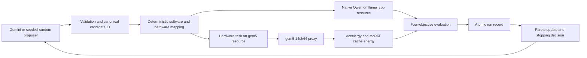

# CHIA Qwen hardware/software co-design

This repository implements a bounded CHIA loop that compares Gemini-guided and
seeded-random search over one shared hardware/software design space. A single
candidate is evaluated by native Qwen inference, a gem5 attention proxy, an
Accelergy + McPAT cache-energy estimator, and a 250-question assessment evaluator.
The four measurements remain separate Pareto objectives.

This README explains the project and reproduces the complete loop on one
Ubuntu server without administrator access. It covers installation, the native
model service, Ray resources, Docker images, configuration, validation,
preflight, one-candidate smoke testing, evidence verification, and the equal
pilot and confirmatory comparisons.

> **Release gate:** do not run a pilot or burst until contract validation,
> release preflight, and the deterministic one-candidate smoke all pass on the
> target server. This repository never starts a large paid campaign
> automatically.

## What the project measures

| Item | Release value |
| --- | --- |
| Native model | Qwen2.5-0.5B-Instruct Q5_K_M |
| Model file | `qwen2.5-0.5b-instruct-q5_k_m.gguf` |
| Model SHA-256 | `041474553fcabfc2a2d67903f9d2c2e50bd92528e670da4f33b5d0ce6e59fd55` |
| Dataset | 250 team-authored questions aligned to five OpenStax textbooks |
| Proxy | packed-Q4 attention with 14 query heads, 2 KV heads, and head dimension 64 |
| gem5 image | `ghcr.io/gem5/devcontainer:v25-1` |
| Energy image | `chia-energy-tools:0.3` |
| Objectives | native latency, proxy simulated time, estimated cache dynamic energy, quality loss |
| Canonical contract | `experiment-contracts/campaigns/final-burst.yaml` |
| Confirmatory comparison | `experiment-contracts/campaigns/confirmatory-gemini38-vs-random-10.yaml` |

The 14/2/64 proxy represents Qwen attention geometry for comparative hardware
design-space exploration. Proxy validation supports context-scaling trend
fidelity, not absolute full-model latency equivalence. gem5 does not simulate
the entire Qwen model.

The energy objective covers dynamic access energy for two L1 instruction
caches, two L1 data caches, and one shared L2 cache. It excludes processor-core
logic, DRAM, interconnect, TLBs, static/leakage energy, and native Qwen energy.

The quality metric is exact answer-text accuracy over 250 unlabeled,
deterministically shuffled multiple-choice questions. The answer key is
isolated from model prompts. Results also report per-subject accuracy and
answer-position diagnostics. This measures assessment accuracy rather than
complete educational or open-ended reasoning quality.

## Execution flow



One Ray node advertises `control`, `llama_cpp`, and `gem5`. gem5 and energy run
sequentially inside the same hardware task and share one hardware deadline.
The controller is the only authoritative run-record writer.

## Validated single-server profile

The no-sudo procedure below was validated on Ubuntu 22.04 x86-64 with 8 logical
CPUs and about 20 GiB usable memory. The observed one-candidate smoke took
895.99 seconds. That is evidence from one run, not a runtime guarantee.

The default ports deliberately avoid common shared-server services:

| Service | Address |
| --- | --- |
| Native Qwen | `127.0.0.1:8082` |
| Ray GCS | `127.0.0.1:6380` |
| Ray Client | `127.0.0.1:10011` |
| Ray dashboard | `127.0.0.1:8266` |

All project-owned software, state, and results live under the operator's home
directory. The only host-level prerequisite is usable Docker access. If
`docker version` fails with a permission error, an administrator must install
Docker and authorize the account before continuing.

## 1. Verify host prerequisites

The account needs outbound HTTPS, Docker access, Git, CMake, and a C/C++
compiler. No project command below uses `sudo`.

```bash
docker version
git --version
cmake --version
g++ --version
curl --version
```

Recommended capacity is at least 8 logical CPUs, 16 GiB RAM, and 40 GiB free
disk. Check the server:

```bash
nproc
free -h
df -h "$HOME"
```

## 2. Install uv and clone the repository

```bash
curl -LsSf https://astral.sh/uv/install.sh | sh
source "$HOME/.local/bin/env"

export CHIA_REF="${CHIA_REF:-release/final-burst}"
export CHIA_REPO="$HOME/CHIA-Project"

git clone --branch "$CHIA_REF" \
  https://github.com/SocialLab-AI/CHIA-Project.git \
  "$CHIA_REPO"

cd "$CHIA_REPO"
uv python install 3.10
uv sync --frozen --python 3.10 \
  --extra dev \
  --extra cluster \
  --extra calibration
source .venv/bin/activate

# Ninja is a user-level build tool; no apt or sudo is required.
uv tool install ninja
export PATH="$HOME/.local/bin:$PATH"

python --version
uv --version
ray --version
ninja --version
```

After the release branch is merged, use `CHIA_REF=main`. For an existing
checkout:

```bash
cd "$HOME/CHIA-Project"
git fetch --prune origin
git switch release/final-burst
git pull --ff-only origin release/final-burst
source "$HOME/.local/bin/env"
uv sync --frozen --python 3.10 \
  --extra dev \
  --extra cluster \
  --extra calibration
source .venv/bin/activate
```

## 3. Download and verify Qwen

```bash
export CHIA_HOME="$HOME/.local/share/chia"
export MODEL_NAME="qwen2.5-0.5b-instruct-q5_k_m.gguf"
export MODEL_PATH="$CHIA_HOME/models/$MODEL_NAME"
export MODEL_SHA256="041474553fcabfc2a2d67903f9d2c2e50bd92528e670da4f33b5d0ce6e59fd55"
export MODEL_URL="https://huggingface.co/Qwen/Qwen2.5-0.5B-Instruct-GGUF/resolve/main/$MODEL_NAME?download=true"

mkdir -p "$CHIA_HOME/models"

curl --fail --location --retry 3 \
  --output "$MODEL_PATH.part" \
  "$MODEL_URL"

printf '%s  %s\n' "$MODEL_SHA256" "$MODEL_PATH.part" | \
  sha256sum --check -

mv "$MODEL_PATH.part" "$MODEL_PATH"
printf '%s  %s\n' "$MODEL_SHA256" "$MODEL_PATH" | \
  sha256sum --check -
```

Do not continue if the checksum differs.

## 4. Build llama.cpp in the home directory

The pinned llama.cpp commit matches the reviewed runtime build. The entire
`bin` directory is retained because `llama-server` uses the shared libraries
beside it.

```bash
export LLAMA_CPP_REF="543158132"
export LLAMA_SRC="$HOME/.cache/chia/llama.cpp"
export LLAMA_BUILD="$LLAMA_SRC/build-chia"
export LLAMA_BIN_DIR="$HOME/.local/share/chia/llama.cpp/bin"

mkdir -p "$HOME/.cache/chia"

if [ ! -d "$LLAMA_SRC/.git" ]; then
  git clone https://github.com/ggml-org/llama.cpp.git "$LLAMA_SRC"
fi

git -C "$LLAMA_SRC" fetch --tags --prune
git -C "$LLAMA_SRC" checkout --detach "$LLAMA_CPP_REF"

cmake \
  -S "$LLAMA_SRC" \
  -B "$LLAMA_BUILD" \
  -G Ninja \
  -DCMAKE_BUILD_TYPE=Release \
  -DGGML_NATIVE=ON

cmake --build "$LLAMA_BUILD" \
  --target llama-server \
  --parallel "$(nproc)"

mkdir -p "$LLAMA_BIN_DIR"
cp -a "$LLAMA_BUILD/bin/." "$LLAMA_BIN_DIR/"

LD_LIBRARY_PATH="$LLAMA_BIN_DIR" \
  ldd "$LLAMA_BIN_DIR/llama-server"

LD_LIBRARY_PATH="$LLAMA_BIN_DIR" \
  "$LLAMA_BIN_DIR/llama-server" --version
```

The expected build identity is `b10984-543158132`. HTTPS support in
llama.cpp is unnecessary because the service listens only on localhost HTTP.

## 5. Start the native Qwen service

```bash
cd "$HOME/CHIA-Project"
source "$HOME/.local/bin/env"
source .venv/bin/activate

export CHIA_HOME="$HOME/.local/share/chia"
export CHIA_STATE="$HOME/.local/state/chia"
export MODEL_PATH="$CHIA_HOME/models/qwen2.5-0.5b-instruct-q5_k_m.gguf"
export LLAMA_BIN_DIR="$CHIA_HOME/llama.cpp/bin"

mkdir -p "$CHIA_STATE"

nohup env LD_LIBRARY_PATH="$LLAMA_BIN_DIR" \
  "$LLAMA_BIN_DIR/llama-server" \
  --model "$MODEL_PATH" \
  --alias qwen2.5-0.5b-instruct-q5_k_m \
  --host 127.0.0.1 \
  --port 8082 \
  --threads 4 \
  --ctx-size 2048 \
  --parallel 1 \
  >"$CHIA_STATE/llama-server-8082.log" 2>&1 &

printf '%s\n' "$!" >"$CHIA_STATE/llama-server-8082.pid"
```

Wait for readiness and verify the live identity:

```bash
for attempt in $(seq 1 60); do
  curl -fsS 127.0.0.1:8082/health >/dev/null && break
  sleep 2
done

curl -fsS 127.0.0.1:8082/health
echo

curl -fsS 127.0.0.1:8082/props |
python -c 'import json,sys; p=json.load(sys.stdin); s=p.get("default_generation_settings",{}); print({"model_path":p.get("model_path"),"context_tokens":s.get("n_ctx"),"parallel_slots":p.get("total_slots"),"build_info":p.get("build_info")})'
```

The response must show the selected model path, context `2048`, one parallel
slot, and build `b10984-543158132`.

## 6. Install the hardware images

```bash
cd "$HOME/CHIA-Project"
docker pull ghcr.io/gem5/devcontainer:v25-1

cd infra/energy
set -a
source versions.env
set +a

docker build \
  --build-arg "ACCELERGY_REF=$ACCELERGY_REF" \
  --build-arg "PLUGIN_REF=$PLUGIN_REF" \
  --build-arg "MCPAT_REF=$MCPAT_REF" \
  --tag chia-energy-tools:0.3 \
  .

cd "$HOME/CHIA-Project"
docker image inspect ghcr.io/gem5/devcontainer:v25-1 >/dev/null
docker image inspect chia-energy-tools:0.3 >/dev/null

docker image inspect chia-energy-tools:0.3 \
  --format '{{json .Config.Labels}}'
```

## 7. Start an isolated one-node Ray cluster

The separate ports and home-directory temporary path allow this deployment to
coexist with another account's services on a shared server.

```bash
cd "$HOME/CHIA-Project"
source "$HOME/.local/bin/env"
source .venv/bin/activate

export CHIA_STATE="$HOME/.local/state/chia"
export RAY_TMP="$CHIA_STATE/ray-single-server"
mkdir -p "$RAY_TMP"

ray start \
  --head \
  --port=6380 \
  --ray-client-server-port=10011 \
  --dashboard-port=8266 \
  --dashboard-host=127.0.0.1 \
  --dashboard-agent-listen-port=0 \
  --min-worker-port=20000 \
  --max-worker-port=29999 \
  --temp-dir="$RAY_TMP" \
  --disable-usage-stats \
  --resources='{"control":1,"llama_cpp":1,"gem5":1}'

sleep 10
ray status --address=127.0.0.1:6380
```

The status must show one each of `control`, `llama_cpp`, and `gem5` with no
pending nodes or recent failures.

## 8. Create the no-sudo deployment configuration

The canonical YAML defines the experiment methodology. This ignored local copy
records server-specific paths, ports, and the truthful integration backend.

```bash
cd "$HOME/CHIA-Project"

export CHIA_HOME="$HOME/.local/share/chia"
export CHIA_STATE="$HOME/.local/state/chia"
export CHIA_CONFIG="$CHIA_STATE/final-burst.single-server.local.yaml"

mkdir -p "$CHIA_STATE"
cp experiment-contracts/campaigns/final-burst.yaml "$CHIA_CONFIG"

sed -i \
  -e 's/^tier: pilot$/tier: integration/' \
  -e 's/^backend: contabo$/backend: local/' \
  -e "s|^results_root: results$|results_root: $HOME/CHIA-Project/results|" \
  -e 's|^ray_address: auto$|ray_address: ray://127.0.0.1:10011|' \
  -e 's|endpoint: http://127.0.0.1:8081|endpoint: http://127.0.0.1:8082|' \
  -e "s|assets_root: /opt/chia/models|assets_root: $CHIA_HOME/models|" \
  "$CHIA_CONFIG"

grep -E \
  '^(tier|backend|results_root|ray_address):|^[[:space:]]+(endpoint|assets_root):' \
  "$CHIA_CONFIG"
```

The generated file is intentionally ignored by Git. It contains no secrets.
It preserves the model, dataset, 14/2/64 proxy, design spaces, objectives,
timeouts, stopping rules, and candidate budgets from the canonical contract.

## 9. Validate the checkout

```bash
cd "$HOME/CHIA-Project"
source "$HOME/.local/bin/env"
source .venv/bin/activate
export CHIA_CONFIG="$HOME/.local/state/chia/final-burst.single-server.local.yaml"

uv run python scripts/validate_configs.py
uv run python scripts/verify_evidence_checksums.py

uv run python scripts/run_experiment.py \
  --config "$CHIA_CONFIG" \
  --validate-only

uv run pytest -q -m "not scheduling"
git diff --check
```

These checks validate contracts and deterministic code. They do not execute
the real native, gem5, or energy workloads.

## 10. Run the release preflight

Dataset permission is an operator attestation. Set the variable only after the
team-provided assessment is approved for the campaign.

```bash
cd "$HOME/CHIA-Project"
source "$HOME/.local/bin/env"
source .venv/bin/activate
export CHIA_CONFIG="$HOME/.local/state/chia/final-burst.single-server.local.yaml"
export TEAM_ASSESSMENT_LLM_PERMISSION_CONFIRMED=1

uv run python scripts/preflight_release.py \
  --config "$CHIA_CONFIG"
```

A passing preflight verifies the model path, hash, context, slots, runtime
build, Ray resources, Docker access, pinned images, and a real bounded
Accelergy + McPAT round trip with five cache components. It does not run gem5
or call Gemini. The energy stage can use the configured 600-second limit.

## 11. Run one deterministic smoke candidate

```bash
cd "$HOME/CHIA-Project"
source "$HOME/.local/bin/env"
source .venv/bin/activate
export CHIA_CONFIG="$HOME/.local/state/chia/final-burst.single-server.local.yaml"
export TEAM_ASSESSMENT_LLM_PERMISSION_CONFIRMED=1

if [ -d results/final-burst-smoke ]; then
  mv results/final-burst-smoke \
    "results/final-burst-smoke-$(date -u +%Y%m%dT%H%M%SZ)"
fi

uv run python scripts/run_experiment.py \
  --config "$CHIA_CONFIG" \
  --smoke
```

`--smoke` evaluates exactly one candidate and disables both proposers. It does
not perform multiple CHIA iterations or call Gemini. Software measurement may
still contain 250 question samples inside that single candidate. Reserve at
least one hour for the first 250-question smoke and use its observed duration
to size later campaign budgets.

The smoke is complete only when the whole chain succeeds:

```text
candidate -> validation -> native Qwen -> gem5 14/2/64
          -> cache-energy estimate -> evaluation -> Pareto -> persistence
```

## 12. Verify smoke evidence

```bash
cd "$HOME/CHIA-Project"
source "$HOME/.local/bin/env"
source .venv/bin/activate
export RESULT_DIR="$HOME/CHIA-Project/results/final-burst-smoke"

test -f "$RESULT_DIR/campaign.yaml"
test -f "$RESULT_DIR/environment.json"
test -f "$RESULT_DIR/provenance.json"
test -f "$RESULT_DIR/summary.json"
test -f "$RESULT_DIR/events.jsonl"
test -f "$RESULT_DIR/pareto.json"
test -f "$RESULT_DIR/MANIFEST.sha256"
test "$(find "$RESULT_DIR/runs" -maxdepth 1 -name 'run-*.json' | wc -l)" -eq 1

(cd "$RESULT_DIR" && sha256sum --check MANIFEST.sha256)

uv run python - <<'PY'
import json
from pathlib import Path

root = Path.home() / "CHIA-Project" / "results" / "final-burst-smoke"
summary = json.loads((root / "summary.json").read_text())
run_path = next((root / "runs").glob("run-*.json"))
record = json.loads(run_path.read_text())

assert summary["state"] == "completed", summary
assert record["status"] == "completed", record.get("failure")
assert len(record["energy_result"]["components"]) == 5
assert record["hardware_result"]["correctness"]["status"] == "PASS"
assert record["hardware_result"]["metrics"]["energy_uj"] > 0
assert record["energy_result"]["provenance"]["energy_result_sha256"]
assert set(record["evaluation"]["objectives"]) == {
    "native_latency_ms",
    "proxy_simulated_seconds",
    "estimated_cache_dynamic_energy_uj",
    "answer_quality_loss",
}
print("One-candidate chain verified:", run_path)
PY
```

Generated evidence remains under `results/` and is excluded from Git. Publish
compact reviewed evidence summaries instead of simulator binaries or
machine-specific work directories. The first verified smoke is documented in
[`docs/RESULTS.md`](docs/RESULTS.md) and its
[machine-readable summary](docs/experiments/evidence/final-burst-smoke-20260921/summary.json).

The completed ten-candidate Gemini-guided pilot is also documented in
[`docs/RESULTS.md`](docs/RESULTS.md) with its
[reviewed evidence package](docs/experiments/evidence/final-burst-gemini-20260921/README.md).
It contains nine accepted Gemini proposals and one deterministic fallback after
a rejected duplicate. It is pilot evidence and does not claim that Gemini
outperforms random search.

The final confirmatory 10-versus-10 comparison is documented in
[`docs/RESULTS.md`](docs/RESULTS.md) with its
[reviewed confirmatory evidence](docs/experiments/evidence/final-confirmatory-250q-gemini38-vs-random-20260922/README.md).
All 20 evaluations completed, and independent Pareto recomputation produced a
seven-candidate combined frontier. Candidate `588ef56fbc16...` is the
preferred best-observed candidate for native-latency-prioritized use, subject
to the documented repeat-measurement limitation.

## 13. Run equal three-candidate pilots

Use the measured smoke runtime to reserve adequate time. Run random first
because it makes no paid API calls:

```bash
cd "$HOME/CHIA-Project"
source "$HOME/.local/bin/env"
source .venv/bin/activate
export CHIA_CONFIG="$HOME/.local/state/chia/final-burst.single-server.local.yaml"
export TEAM_ASSESSMENT_LLM_PERMISSION_CONFIRMED=1

uv run python scripts/run_experiment.py \
  --config "$CHIA_CONFIG" \
  --method random
```

Run Gemini only after explicitly approving API use. Enter the key without
placing it in YAML, `.env`, shell history, logs, or results:

```bash
read -rsp "Gemini API key: " GEMINI_API_KEY
echo
export GEMINI_API_KEY

uv run python scripts/run_experiment.py \
  --config "$CHIA_CONFIG" \
  --method gemini

unset GEMINI_API_KEY
```

Both methods use the same candidate budget, model, dataset, design spaces,
14/2/64 proxy, estimator, evaluator, stopping rules, resources, metrics, and
persistence path. The experiment determines whether Gemini finds better
observed or Pareto candidates more efficiently; it does not assume Gemini
wins. Estimated API cost in the usage ledger is not verified live billing.

Do not increase the candidate budget or launch a burst until pilot wall time,
failure rate, disk use, artifact size, and Gemini usage are reviewed.

### Matched 10-versus-10 confirmatory profile

The reviewed confirmatory contract runs Gemini 3.8 Flash and seeded random
search for ten evaluated candidates each. The random seed is `20260922`, which
differs from the first comparison. Both arms share the native model,
250-question dataset, design spaces, proxy, energy estimator, evaluator,
candidate budget, stopping limits, resources, and four objective definitions.

Pass a unique `--campaign-id` for each arm. The CLI derives the gem5 and energy
artifact roots from that ID, preventing an earlier campaign from being
overwritten. The rates in `compute-policy.yaml` estimate Gemini usage cost;
the usage ledger is not a live billing statement.

## 14. Stop and restart the rootless services

Stop the native server owned by the current account:

```bash
kill "$(cat "$HOME/.local/state/chia/llama-server-8082.pid")"
rm -f "$HOME/.local/state/chia/llama-server-8082.pid"
```

Stop Ray only when this account owns no other Ray cluster:

```bash
cd "$HOME/CHIA-Project"
source .venv/bin/activate
ray stop --force
```

Restart by repeating steps 5 and 7. Model, build, images, environment, and local
configuration persist across restarts.

## Troubleshooting

| Symptom | Action |
| --- | --- |
| SSH disconnects after a failed command | Do not run `set -e` in the interactive shell. Put strict commands inside `( set -euo pipefail; ... )`. |
| `python: command not found` | `cd "$HOME/CHIA-Project"` and activate `.venv` before project commands. |
| `ninja: command not found` | Run `uv tool install ninja`, source `$HOME/.local/bin/env`, and refresh with `hash -r`. |
| Port `8081` or `6379` belongs to another account | Use the isolated ports in this README; do not stop another account's processes. |
| Ray reports an old persisted session | Use port `6380` and the home-directory `--temp-dir` from step 7. |
| Ray initially says no cluster status | Wait ten seconds and run `ray status --address=127.0.0.1:6380`. |
| `pytest: command not found` | Use `uv run pytest ...`; do not install system pytest. |
| Model hash or path mismatch | Re-run `sha256sum --check` and inspect the live `/props` response. |
| `No such image: chia-energy-tools:0.3` | Rebuild step 6 under the same Docker daemon used by the `gem5` Ray task. |
| Energy preflight appears idle | It may use up to 600 seconds. Inspect `docker ps` and container logs without interrupting it. |
| `results/<campaign>` already exists | Move the existing directory to a timestamped evidence directory before retrying. |
| A candidate fails in `energy_*` | Inspect `failure.runtime_stage`; a completed record cannot exist without verified energy. |

## Repository map and canonical documentation

```text
experiment-contracts/  schemas, campaign, design spaces, policy
src/                   validation, CHIA graph, runtimes, evaluation, records
gem5/                  attention proxy and gem5 configuration
data/                  250-question assessment and isolated evaluator answer key
infra/energy/          pinned Accelergy + McPAT image and wrapper
scripts/               validation, preflight, and campaign entry points
docs/                  architecture, methodology, operations, results, limits
results/               generated evidence; never source data
```

- [Architecture](docs/ARCHITECTURE.md)
- [CHIA loop](docs/CHIA_LOOP.md)
- [Experiment methodology](docs/EXPERIMENT_METHODOLOGY.md)
- [Design space](docs/DESIGN_SPACE.md)
- [Objectives](docs/OBJECTIVES.md)
- [Running stages](docs/RUNNING.md)
- [Results and evidence](docs/RESULTS.md)
- [Limitations](docs/LIMITATIONS.md)

The authoritative machine-readable methodology is
[`experiment-contracts/campaigns/final-burst.yaml`](experiment-contracts/campaigns/final-burst.yaml).
Server-specific deployment copies must remain uncommitted and must preserve all
scientific fields that are not paths, ports, or truthful infrastructure labels.
