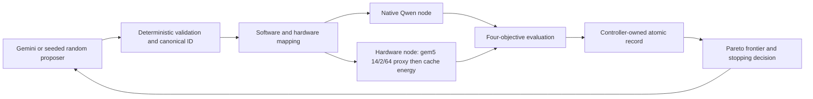

# Architecture

The CHIA head node validates candidates and schedules work by Ray resource labels. A native inference worker owns Qwen evaluation. A gem5 worker owns both the attention simulation and its dependent cache-energy estimate. The controller owns final records; workers never write an authoritative run record.

Resource labels are `control`, `llama_cpp`, and `gem5`. One `gem5` Ray task runs the simulation, reads its local statistics, runs Accelergy + McPAT, verifies the result, and returns one energy-enriched hardware result. Ray never schedules energy as a second task, so local artifacts cannot be handed to another worker. The configured hardware timeout and remaining campaign deadline bound the complete gem5-plus-energy sequence; the energy timeout is an additional cap within that shared deadline.

The native and simulated metric domains remain separate. llama.cpp measures Qwen HTTP inference. gem5 executes one packed-Q4 grouped-query attention kernel. Accelergy estimates dynamic energy for the modeled L1I, L1D, and shared L2 cache accesses from that gem5 run.
