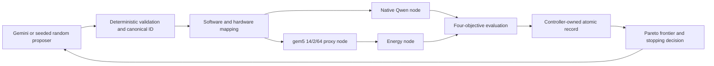

# Architecture

The CHIA head node validates candidates and schedules work by Ray resource labels. A native inference worker owns Qwen evaluation. A gem5 worker owns both the attention simulation and its dependent cache-energy estimate. The controller owns final records; workers never write an authoritative run record.

Resource labels are `control`, `llama_cpp`, and `gem5`. Energy follows gem5 on the `gem5` resource so it consumes the exact hardware run before another candidate can reuse that run directory. All runtime calls receive the smaller of their configured timeout and the remaining campaign time.

The native and simulated metric domains remain separate. llama.cpp measures Qwen HTTP inference. gem5 executes one packed-Q4 grouped-query attention kernel. Accelergy estimates dynamic energy for the modeled L1I, L1D, and shared L2 cache accesses from that gem5 run.
