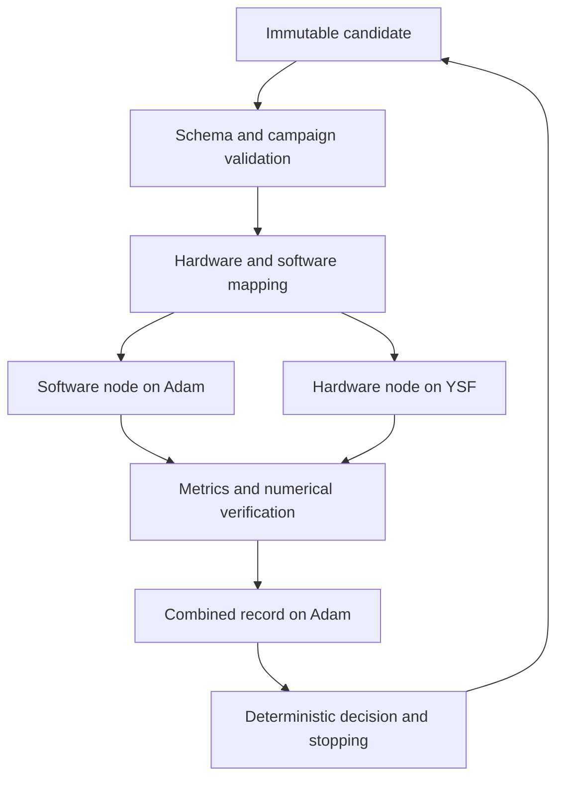

# Deterministic full loop

The supported entrypoint is `scripts/run_experiment.py`. It uses the current repository structure and the architecture in the [implementation proposal](https://docs.google.com/document/d/1V2xZ93ECBvg1yPFOnsgZREtmpG5Drx7ZBAzv0lIf3S4/edit). See [IMPLEMENTATION_STATUS.md](IMPLEMENTATION_STATUS.md) for current evidence and pending work.

## What executes



`src/orchestration/chia.py` owns campaign limits, duplicate rejection and history. `experiment.py` owns one candidate execution. `dispatch.py` binds the real CHIA `ChiaFunction` to the same functions used by local tests. No fake CHIA implementation is used when dependencies are missing: local mode is explicitly local, and CHIA mode fails preflight without the cluster extra.

Nodes exchange success/failure envelopes so an application error does not erase the sibling's metrics. Infrastructure failures are also caught by the Adam driver, which writes the failed record locally. Automatic Ray retries are disabled. Only declared transient runtime errors receive bounded retries. Invalid candidates, deterministic build failures, numerical failures and timeouts are not retried.

## Deliberate testing profile

The proposal's Qwen/Ollama test profile has two active software knobs: temperature `[0.0, 0.2, 0.5]` and output limit `[64, 128, 256]`. The default campaign runs three predetermined combined candidates. The finalized Llama 3.2 inference values are preserved with no new approved search ranges. The user's later inference-only scope decision supersedes the proposal's retrieval work; those fields and tasks have been removed.

Version 0.3.0 `loop_candidate` and `loop_record` definitions extend the existing master schema. Existing 0.2 definitions remain available. Candidates contain SW knobs, HW knobs, attention shape and measurement controls. Endpoints, paths, images, credentials and numerical tolerances are operator runtime settings, never optimizer-controlled knobs.

## Local review commands

From the repository root:

```powershell
uv sync --extra cluster
uv run pytest -q -m 'not scheduling'
uv run python scripts/validate_configs.py
uv run python scripts/run_experiment.py --validate-only
$env:CHIA_RUN_SCHEDULING_TESTS='1'
uv run pytest -q tests/test_scheduling.py
```

The scheduling test launches only local Ray processes and shuts down that test session. It does not contact Adam/YSF. Do not confuse mocked runtime tests or local scheduling proof with real remote simulator/model execution.

For a real local campaign, copy `experiment-contracts/testing/full-loop.local.example.yaml` to an ignored `*.local.yaml`. Choose a unique campaign ID, fill a reviewed numerical tolerance and ensure the model/image are already installed. Then:

```text
python scripts/run_experiment.py --config experiment-contracts/testing/full-loop.local.yaml
```

No model or Docker image is downloaded automatically. The hardware preflight resolves an already-installed image to immutable identity. It builds the workload in a per-run directory, applies fixed and variable settings, checks `config.json`, verifies the workload exit/shape/numerical errors, and parses statistics. Numerical tolerances are mandatory operator decisions, not values invented by the implementation.

## Worker placement and reproducibility

- Adam advertises `control: 1` and `ollama: 1`. Control nodes request a small control-label fraction; the software node reserves four host CPUs and one Ollama slot.
- YSF advertises `gem5: 1`. The hardware node reserves one host CPU and the gem5 slot. Simulated core count remains two, independent of Ray CPU reservation.
- CHIA injects worker resource flags from `available_node_types`; the head start command explicitly advertises its control/Ollama labels.
- `render_cluster_config.py` generates ignored host overlays using environment-supplied addresses, project path, activation paths and key path. It never reads private-key contents or starts a server.
- Source sync excludes credentials, environment files, local overlays, generated results and local CLI settings. Adam/YSF addresses and existing activation paths in the tracked template are retained as the known topology; review the generated overlay before server use.
- Host-native CHIA/Ray and Ollama remain host-native. Only gem5 and its compiler run in Docker. Linux containers run as the host UID/GID with networking disabled, dropped capabilities and no-new-privileges. Docker daemon access remains a host privilege requiring trusted workers.
- Each record contains candidate hash, requested and executed knobs, native metrics, simulator metrics, correctness tolerance/evidence, worker events, git revision, dirty status, source hashes, installed package versions, model digest, image identity and executable hash.

Raw stdout/stderr are not copied into shared logs. Shared summaries contain only byte counts/hashes. This avoids trying to recognize every possible secret in arbitrary runtime output. Simulator statistics and resolved configuration remain in the run evidence directory. Failure records never include rejected candidate secrets or arbitrary exception text.

## Measurement semantics

Current hardware timing is **whole-program simulation including setup and FP32 reference execution**. It is explicitly labeled in records. Numerical checks now enforce approved tolerances externally, despite the old C PASS marker only testing finiteness. A dedicated Q4-only ROI remains a research follow-up; changing clock mapping invalidates direct performance comparisons with the old recorded baseline until rerun.

The frequency knob now controls a separate CPU clock; the shared system clock remains 1 GHz. L1 caches inherit the CPU clock, L2/buses remain on the system clock. Cache latency fields map to tag/data/response parameters as an explicit bundle. This is an experiment model, not measured physical cache latency/area.

Native latency is software HTTP roundtrip time. Proxy simulated time and simulator host runtime are separate. The smoke profile does not report educational quality. Its Pareto frontier is an integration diagnostic across native latency and proxy time within equal context, not proof of an improved Tutor. The pure final-Tutor inference mapper is present; assets, tokenizer checks, GGUF metadata verification and held-out OpenStax evaluation remain activation gates.

## Optional Gemini CLI

The CLI adapter is implemented separately and tested without paid calls. It uses strict JSON, exact active-field sets, deterministic validation, duplicate rejection, compact history, an isolated CLI configuration home and tool-denial policy. It uses no MCP integration and never gives the model a shell command execution interface.

Activation is off by default. It requires a pinned native CLI launcher/version and selected model. **The current mandatory dollar-metering compute policy blocks activation until reviewed CLI pricing/metering is implemented.** Do not disable that policy to make the demo run. A call-count cap is not a dollar budget. The existing SDK proposer is retained as legacy reference and is not invoked by the combined loop.

Malformed/duplicate proposals have a deterministic fallback path. Candidate iteration limits and infrastructure-failure stopping remain programmatic. CLI safety/version behavior and actual model usage must be verified before the first adaptive campaign.

## Review before push and server phase

Review this branch in Antigravity, inspect the diff and checklist, and confirm local tests. No push or remote execution is performed by this implementation task. The next phase is to pull the reviewed branch on Adam, generate the topology overlay, verify exact Python/Ray/CHIA versions and labels, inspect local Ollama model/image identities, approve Q4 tolerance, and execute one candidate before the three-candidate campaign.

Primary API references: [CHIA functions](https://docs.chialoops.ai/en/latest/user_guides/chia_function.html), [cluster configuration](https://docs.chialoops.ai/en/latest/user_guides/cluster_config_reference.html), [Ollama generate](https://docs.ollama.com/api/generate), [Gemini headless output](https://geminicli.com/docs/cli/headless/), [Gemini policy engine](https://geminicli.com/docs/reference/policy-engine/). Runtime installation uses the locked cluster extra; upstream HEAD documentation is not execution evidence.
