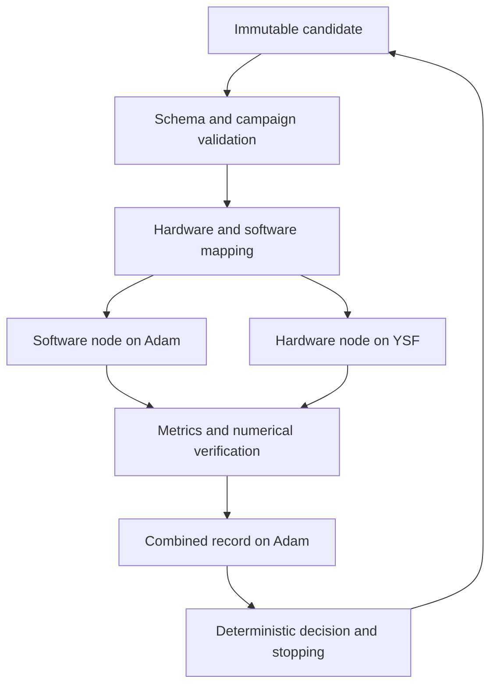

# Deterministic full loop

The supported entrypoint is `scripts/run_experiment.py`. It uses the current repository structure and the architecture in the [implementation proposal](https://docs.google.com/document/d/1V2xZ93ECBvg1yPFOnsgZREtmpG5Drx7ZBAzv0lIf3S4/edit). See [IMPLEMENTATION_STATUS.md](IMPLEMENTATION_STATUS.md) for current evidence and pending work.

## What executes



`src/orchestration/chia.py` owns campaign limits, duplicate rejection and history. `experiment.py` owns one candidate execution. `dispatch.py` binds the real CHIA `ChiaFunction` to the same functions used by local tests. No fake CHIA implementation is used when dependencies are missing: local mode is explicitly local, and CHIA mode fails preflight without the cluster extra.

Nodes exchange success/failure envelopes so an application error does not erase the sibling's metrics. Infrastructure failures are also caught by the Adam driver, which writes the failed record locally. Automatic Ray retries are disabled. Only declared transient runtime errors receive bounded retries. Invalid candidates, deterministic build failures, numerical failures and timeouts are not retried.

## Deliberate testing profile

The executable Qwen/llama.cpp profile has two active software knobs: temperature `[0.0, 0.2, 0.5]` and output limit `[128, 256, 384]`. Model identity, Q5_K_M weights, four CPU threads and request concurrency one remain fixed. The default campaign runs three predetermined combined candidates, while Gemini may propose only values inside the same reviewed spaces. Retrieval remains outside project scope.

Version 0.3.0 `loop_candidate` and `loop_record` definitions extend the existing master schema. Existing 0.2 definitions remain available. Candidates contain SW knobs, HW knobs, attention shape and measurement controls. Endpoints, paths, images, credentials and numerical tolerances are operator runtime settings, never optimizer-controlled knobs.

## Local review commands

From the repository root:

```powershell
uv sync --extra cluster
uv run pytest -q -m 'not scheduling'
uv run python scripts/validate_configs.py
uv run python scripts/run_experiment.py --validate-only
$env:CHIA_RUN_SCHEDULING_TESTS='1'
uv run pytest -q tests/test_scheduling.py
```

The scheduling test launches only local Ray processes and shuts down that test session. It does not contact Adam/YSF. Do not confuse mocked runtime tests or local scheduling proof with real remote simulator/model execution.

When `--config` and `--validate-only` are used together, the command validates the complete operator campaign configuration as well as every candidate. It rejects malformed YAML structure, unknown fields, unsupported tier/backend combinations, unsafe llama.cpp endpoints, incomplete artifact bindings, invalid retry/timeout settings and missing numerical-tolerance fields without connecting to Ray or executing a runtime.

For a real local campaign, copy `experiment-contracts/testing/full-loop.local.example.yaml` to an ignored `*.local.yaml`. Choose a unique campaign ID, fill a reviewed numerical tolerance and ensure the model/image are already installed. Then:

```text
python scripts/run_experiment.py --config experiment-contracts/testing/full-loop.local.yaml
```

No model or Docker image is downloaded automatically. The hardware preflight resolves an already-installed image to immutable identity. It builds the workload in a per-run directory, applies fixed and variable settings, checks `config.json`, verifies the workload exit/shape/numerical errors, and parses statistics. Numerical tolerances are mandatory operator decisions, not values invented by the implementation.

## Worker placement and reproducibility

- Adam advertises `control: 1` and `llama_cpp: 1`. Control nodes request a small control-label fraction; the software node reserves four host CPUs and the single llama.cpp server slot.
- YSF advertises `gem5: 1`. The hardware node reserves one host CPU and the gem5 slot. Simulated core count remains two, independent of Ray CPU reservation.
- CHIA injects worker resource flags from `available_node_types`; the head start command explicitly advertises its control/llama.cpp labels.
- `render_cluster_config.py` generates ignored host overlays using environment-supplied addresses, project path, activation paths and key path. It never reads private-key contents or starts a server.
- Source sync excludes credentials, environment files, local overlays, generated results and local CLI settings. Adam/YSF addresses and existing activation paths in the tracked template are retained as the known topology; review the generated overlay before server use.
- Host-native CHIA/Ray and the loopback llama.cpp service remain host-native. Only gem5 and its compiler run in Docker. Linux containers run as the host UID/GID with networking disabled, dropped capabilities and no-new-privileges. Docker daemon access remains a host privilege requiring trusted workers.
- Each record contains candidate hash, requested and executed knobs, native metrics, simulator metrics, correctness tolerance/evidence, worker events, git revision, dirty status, source hashes, installed package versions, GGUF SHA-256, llama.cpp build, image identity and executable hash.

Raw stdout/stderr are not copied into shared logs. Shared summaries contain only byte counts/hashes. This avoids trying to recognize every possible secret in arbitrary runtime output. Simulator statistics and resolved configuration remain in the run evidence directory. Failure records never include rejected candidate secrets or arbitrary exception text.

## Measurement semantics

Current hardware timing is **whole-program simulation including setup and FP32 reference execution**. It is explicitly labeled in records. Numerical checks now enforce approved tolerances externally, despite the old C PASS marker only testing finiteness. A dedicated Q4-only ROI remains a research follow-up; changing clock mapping invalidates direct performance comparisons with the old recorded baseline until rerun.

The frequency knob now controls a separate CPU clock; the shared system clock remains 1 GHz. L1 caches inherit the CPU clock, L2/buses remain on the system clock. Cache latency fields map to tag/data/response parameters as an explicit bundle. This is an experiment model, not measured physical cache latency/area.

Native latency is software HTTP roundtrip time for each question in the custom mixed educational QA set. Proxy simulated time and simulator host runtime are separate. Deterministic required-concept coverage provides a reproducible initial quality signal; it is not human judgment and does not prove educational effectiveness. The Pareto frontier compares native latency, proxy time and quality loss only within the same evaluation group. A held-out set with reviewed provenance and human review remain future research work.

## Optional Gemini SDK optimizer

The Google GenAI SDK proposer is integrated but disabled by default. It receives compact experiment history plus schema-derived fixed knobs, active values and cross-knob constraints. Structured output restricts the response to the exact candidate delta shape. The returned JSON is still treated as untrusted and must pass the same deterministic schema, design-space, semantic and duplicate checks as built-in candidates. It uses no MCP integration and receives no shell or filesystem tool.

Activation requires `optimizer.enabled: true`, the reviewed SDK model, an API credential supplied only through the environment, `max_calls`, `budget_usd` and a timeout. Token usage and estimated cost are persisted after every call. The controller stops further optimizer calls when the call or cost limit is reached and falls back to deterministic candidates after malformed output or SDK failure.

Candidate iteration limits, wall deadline, duplicate handling, repeated runtime failure stopping and Pareto calculation remain deterministic program logic. Gemini never decides whether an invalid candidate should execute.

## Review before push and server phase

After pulling on Adam, restart the CHIA cluster so the `llama_cpp` resource label replaces `ollama`, start the pinned loopback llama.cpp service, validate the local campaign file, and execute one candidate before increasing the iteration limit or enabling Gemini.

Primary API references: [CHIA functions](https://docs.chialoops.ai/en/latest/user_guides/chia_function.html), [cluster configuration](https://docs.chialoops.ai/en/latest/user_guides/cluster_config_reference.html), [llama.cpp server](https://github.com/ggml-org/llama.cpp/tree/master/tools/server), and [Google GenAI structured output](https://googleapis.github.io/python-genai/). Runtime installation uses locked dependencies and pinned artifact provenance; upstream documentation alone is not execution evidence.
