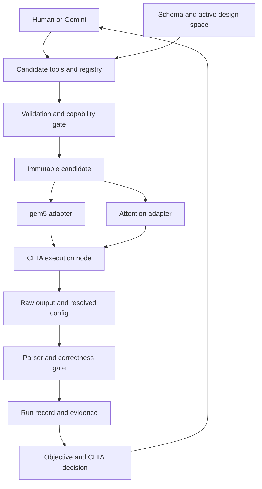

# CHIA design parameter and metric mapping

> Issue #11 · Review draft · Runtime bindings PLANNED · 10 September 2026

## Purpose

Define the interface contract for Issue #11 so Yehya, the CHIA loop and Gemini can trace every experiment field to its future implementation and trace measured outputs back to an optimization decision. Change immutable candidate configurations through a validated service; backend adapters alone translate values into simulator or workload settings.

Review basis — 10 September 2026. The clean local checkout is feat/experiment-contracts at 2f94bd87a5b77588075c040a541b0fce25c97e63. A read-only remote lookup confirmed main at 98ee9a9b6d817f84608a9c9e8fad011cbf5d6e94. Inspection of that main tree shows the older config-schema and compute-policy-v0.2 layout, without experiment-contracts. This document targets the updated feature-branch contract, not a verified merge into main. The GitHub connector could not retrieve Issue #11; its title and scope come from the request.

FACT denotes inspected contracts or official documentation. PROPOSED denotes our interface design. UNKNOWN denotes an unresolved binding or measurement definition. All runtime mappings in this document are PLANNED. Existing schema validation is real, but it is not evidence that a knob reaches gem5. Team documentation labels FP32, Q4 and DDR3 validated; no proxy simulation was rerun for this deliverable.

## Architecture

The Tutor LLM is the application being optimized. Gemini proposes candidates. CHIA orchestrates nodes and feedback. gem5 simulates an Attention Kernel proxy. Native application measurements and simulated proxy measurements remain separate.



FACT — CHIA loops express Python data and control flow; ChiaFunction dispatches work using chia_remote and get resolves results. ChiaTool registers typed methods for agent calls. The candidate model, registry, objective policy and six tools below are project interfaces, not verified built-in CHIA design-parameter or objective APIs. Source: CHIA Basics, ChiaFunction and ChiaTool [S1–S3].

| Project layer | Proposed responsibility |
| --- | --- |
| Design parameters | A complete candidate dictionary derived from the experiment schema plus campaign design-space restrictions. |
| Programmatic CHIA edge | Validate → resolve → execute → parse → build record → score. Pass candidate/reference and return structured results. |
| Agentic CHIA edge | Gemini uses an allowlisted ChiaTool wrapper over the same candidate service. |
| Objective decision | A pure score_candidate(record, policy) function rejects ineligible runs, then ranks comparable candidates. CHIA passes this feedback to the next proposal. |
| Resource placement | CHIA worker resources and compute policy place real jobs. hardware.cores describes simulated cores only. |

## Mapping Model

A mapping joins three sources: schema legality, campaign search eligibility and adapter capability. A value must pass all three. The schema may allow context_tokens 1024–4096, but the active campaign permits only 128, 256 and 512 as evaluation conditions. Fixed values still need backend bindings. Compare candidates within the same workload condition.

Declaration convention: attention fields below are in experiment-contracts/attention-experiments/attention-experiment.schema.json. Field hardware.l1d_cache_kib means JSON Pointer #/properties/hardware/properties/l1d_cache_kib. The same dotted-path-to-properties rule applies to every field. Design-space locations refer to experiment-contracts/attention-experiments/design-space.yaml; its declaration is attention-design-space.schema.json. Units are KiB = 1024 bytes and MiB = 1024² bytes.

| ID and backend owner | Proposed module and class |
| --- | --- |
| CPU — gem5 | src/adapters/gem5/cpu.py<br>Gem5CPUAdapter |
| CACHE — gem5 | src/adapters/gem5/cache.py<br>Gem5CacheAdapter |
| MEM — gem5 | src/adapters/gem5/memory.py<br>Gem5MemoryAdapter |
| ATTN — attention workload | src/adapters/attention/adapter.py<br>AttentionAdapter |
| RUN — execution service | src/runners/experiment.py<br>ExperimentRunner |
| CFG — candidate service | src/config/service.py<br>CandidateService |
| MET — metrics service | src/metrics/gem5_parser.py<br>Gem5MetricParser |
| REC — record service | src/metrics/run_record.py<br>RunRecordBuilder |
| TUTOR — native Tutor | src/adapters/tutor/adapter.py<br>TutorAdapter |
| EVAL — native evaluation | src/metrics/tutor_evaluator.py<br>TutorEvaluator |
| POL — compute governance | src/policy/gate.py<br>ComputePolicyGate |

Every module/class above is a proposed destination; none is claimed to exist in the inspected checkout. Method names below resolve through this table. No implementation stubs are included: a passing no-op adapter would create false confidence.

## Knob Mapping Table

Each row includes schema limits, fixed/variable classification, exact design-space source, handler, backend target, dependencies and related metrics. All rows have wiring status PLANNED. Baseline values are recorded independently of schema defaults.

### Official active hardware knobs

These are the ONLY eight hardware knobs CHIA may actively explore at this stage. All hardware bindings have implementation status `pending_mapping` or `pending_validation` until the gem5 adapter is implemented and verified.

| Field and contract | Intended purpose | Planned binding | Constraints and evidence |
| --- | --- | --- | --- |
| hardware.cpu_model<br>ACTIVE: true<br>Subsystem: hardware/gem5<br>VARIABLE: RiscvTimingSimpleCPU / RiscvO3CPU<br>Baseline: RiscvO3CPU<br>Source: active_knobs.cpu_model | Simulated CPU core execution model | Target: TBD after gem5 adapter implementation<br>Status: pending_mapping | Allowlist the two schema model names; gem5 build must support RISCV64.<br>Related: cycles, IPC, simulated time |
| hardware.cores<br>ACTIVE: true<br>Subsystem: hardware/gem5<br>VARIABLE: 1 / 2 / 4<br>Baseline: 2<br>Source: active_knobs.cores | Number of simulated CPU cores | Target: TBD after gem5 adapter implementation<br>Status: pending_mapping | Modeled cores are simulated target cores. Note: relationship with software_threads: 2 remains a future clarification.<br>Related: cycles, simulated time |
| hardware.frequency_ghz<br>ACTIVE: true<br>Subsystem: hardware/gem5<br>VARIABLE: 1 / 2 / 3 / 4<br>Baseline: 1<br>Source: active_knobs.frequency_ghz | CPU clock frequency and clock domain in GHz | Target: TBD after gem5 adapter implementation<br>Status: pending_mapping | CPU clock domain is also frequency_ghz; no independent second clock knob. Convert GHz to gem5 clock domain ticks.<br>Related: sim_seconds, cycles |
| hardware.issue_width<br>ACTIVE: true<br>Subsystem: hardware/gem5<br>VARIABLE: 1 / 2 / 4<br>Baseline: 2<br>Source: active_knobs.issue_width | Maximum instruction issue width | Target: TBD after gem5 adapter implementation<br>Status: pending_validation | Applicability: RiscvO3CPU. Pending validation in gem5 adapter before enforcing model-conditional rules.<br>Related: IPC, CPI, cycles |
| hardware.l1d_cache_kib<br>ACTIVE: true<br>Subsystem: hardware/gem5<br>VARIABLE: 16 / 32 / 64<br>Baseline: 64<br>Source: active_knobs.l1d_cache_kib | Per-core L1 data cache capacity in KiB | Target: TBD after gem5 adapter implementation<br>Status: pending_mapping | Convert KiB to bytes (1024); per-core cache hierarchy.<br>Related: l1d_miss_rate, cycles, simulated time |
| hardware.l1d_associativity<br>ACTIVE: true<br>Subsystem: hardware/gem5<br>VARIABLE: 2 / 4 / 8<br>Baseline: 4<br>Source: active_knobs.l1d_associativity | Per-core L1 data cache associativity | Target: TBD after gem5 adapter implementation<br>Status: pending_mapping | Validate geometry with cache line size (64 bytes).<br>Related: l1d_miss_rate, cycles |
| hardware.l2_cache_kib<br>ACTIVE: true<br>Subsystem: hardware/gem5<br>VARIABLE: 256 / 512 / 1024<br>Baseline: 1024<br>Source: active_knobs.l2_cache_kib | Total shared L2 cache capacity in KiB | Target: TBD after gem5 adapter implementation<br>Status: pending_mapping | Shared L2 cache capacity across all simulated cores.<br>Related: l2_miss_rate, cycles, simulated time |
| hardware.l2_associativity<br>ACTIVE: true<br>Subsystem: hardware/gem5<br>VARIABLE: 4 / 8 / 16<br>Baseline: 8<br>Source: active_knobs.l2_associativity | Shared L2 cache associativity | Target: TBD after gem5 adapter implementation<br>Status: pending_mapping | Validate geometry with cache line size (64 bytes).<br>Related: l2_miss_rate, cycles |

### Fixed hardware parameters

These are fixed parameters of the official hardware baseline and must NOT be exposed as active search knobs.

| Field and contract | Intended purpose | Planned binding | Constraints and evidence |
| --- | --- | --- | --- |
| hardware.isa<br>ACTIVE: false<br>Subsystem: hardware/gem5<br>FIXED: RISCV64<br>Baseline: RISCV64<br>Source: fixed_parameters.isa | Canonical target architecture | Target: TBD after gem5 adapter implementation<br>Status: pending_mapping | RISC-V 64-bit canonically represented as RISCV64. |
| hardware.l1i_cache_kib<br>ACTIVE: false<br>Subsystem: hardware/gem5<br>FIXED: 16<br>Baseline: 16<br>Source: fixed_parameters.l1i_cache_kib | Fixed L1 instruction cache size (KiB) | Target: TBD after gem5 adapter implementation<br>Status: pending_mapping | 16 KiB per core. |
| hardware.l1i_associativity<br>ACTIVE: false<br>Subsystem: hardware/gem5<br>FIXED: 2<br>Baseline: 2<br>Source: fixed_parameters.l1i_associativity | Fixed L1 instruction cache associativity | Target: TBD after gem5 adapter implementation<br>Status: pending_mapping | 2-way set associative. |
| hardware.l1i_latency_cycles<br>ACTIVE: false<br>Subsystem: hardware/gem5<br>FIXED: 2<br>Baseline: 2<br>Source: fixed_parameters.l1i_latency_cycles | Fixed L1 instruction cache latency (cycles) | Target: TBD after gem5 adapter implementation<br>Status: pending_mapping | Hit latency profile in cycles. |
| hardware.l1d_latency_cycles<br>ACTIVE: false<br>Subsystem: hardware/gem5<br>FIXED: 2<br>Baseline: 2<br>Source: fixed_parameters.l1d_latency_cycles | Fixed L1 data cache latency (cycles) | Target: TBD after gem5 adapter implementation<br>Status: pending_mapping | Hit latency profile in cycles. |
| hardware.l2_latency_cycles<br>ACTIVE: false<br>Subsystem: hardware/gem5<br>FIXED: 20<br>Baseline: 20<br>Source: fixed_parameters.l2_latency_cycles | Fixed shared L2 cache latency (cycles) | Target: TBD after gem5 adapter implementation<br>Status: pending_mapping | L2 hit latency in cycles. |
| hardware.memory_type<br>ACTIVE: false<br>Subsystem: hardware/gem5<br>FIXED: DDR3_1600_8x8<br>Baseline: DDR3_1600_8x8<br>Source: fixed_parameters.memory_type | Fixed gem5 memory controller/DRAM model | Target: TBD after gem5 adapter implementation<br>Status: pending_mapping | Validated memory model DDR3_1600_8x8. DDR4 strictly excluded. |
| hardware.memory_size_mib<br>ACTIVE: false<br>Subsystem: hardware/gem5<br>FIXED: 16<br>Baseline: 16<br>Source: fixed_parameters.memory_size_mib | Physical address space range in MiB | Target: TBD after gem5 adapter implementation<br>Status: pending_mapping | 16 MiB proxy physical address space. |
| hardware.simulation_mode<br>ACTIVE: false<br>Subsystem: hardware/gem5<br>FIXED: SE<br>Baseline: SE<br>Source: fixed_parameters.simulation_mode | gem5 execution mode | Target: TBD after gem5 adapter implementation<br>Status: pending_mapping | Syscall-emulation (SE) mode. |
| hardware.software_threads<br>ACTIVE: false<br>Subsystem: hardware/gem5<br>FIXED: 2<br>Baseline: 2<br>Source: fixed_parameters.software_threads | Simulated software threads baseline | Target: TBD after gem5 adapter implementation<br>Status: pending_mapping | Fixed at 2 for this version as specified by teammate; relationship with varying core count remains a future clarification. |


### Attention software

| Field and contract | Planned binding | Constraints and evidence |
| --- | --- | --- |
| software.implementation<br>FIXED  /  AttentionKernelQuantizedKV<br>Baseline: AttentionKernelQuantizedKV<br>Source: experiment schema const; baseline.attention.yaml | ATTN: AttentionAdapter.select_implementation()<br>Target: Allowlisted attention workload build | Fixed implementation ID; resolve a versioned executable. No arbitrary binary paths.<br>Related: checksum, passed, instructions<br>PLANNED |
| software.kv_format<br>VARIABLE  /  FP32 / Q4<br>Baseline: FP32<br>Source: active_candidates.software.kv_format | ATTN: AttentionAdapter.set_kv_format()<br>Target: K/V storage packing and matching attention/dequantization path | FP32/Q4 active; FP16/Q8 gated. CLI or build flag is not yet established. Q4 is KV representation, not Tutor model quantization.<br>Related: checksum, passed, cycles, cache misses<br>PLANNED |
| software.threads<br>FIXED  /  integer ≥ 1<br>Baseline: 1<br>Source: fixed.threads | ATTN: AttentionAdapter.set_threads()<br>Target: Kernel worker/thread count | Campaign fixed at 1. Schema integer ≥1 is broader; require threads ≤ cores and proven parallel kernel before expansion.<br>Related: passed; simulated time<br>PLANNED |

### Workload controls

| Field and contract | Planned binding | Constraints and evidence |
| --- | --- | --- |
| workload.context_tokens<br>EVALUATION AXIS  /  128 / 256 / 512 / 1024 / 2048 / 4096<br>Baseline: 512<br>Source: evaluation_axes.context_tokens | ATTN: AttentionAdapter.set_shape()<br>Target: K/V sequence length and loop bounds | Validate allocation within 16 MiB. Proposed GQA gate: query_heads divisible by kv_heads. Pin layout, packing and seed; confirm with kernel owner.<br>Related: checksum, passed, instructions, cycles<br>PLANNED |
| workload.query_heads<br>FIXED  /  integer ≥ 1<br>Baseline: 4<br>Source: fixed.query_heads | ATTN: AttentionAdapter.set_shape()<br>Target: Query tensor head count | Validate allocation within 16 MiB. Proposed GQA gate: query_heads divisible by kv_heads. Pin layout, packing and seed; confirm with kernel owner.<br>Related: checksum, passed, instructions, cycles<br>PLANNED |
| workload.kv_heads<br>FIXED  /  integer ≥ 1<br>Baseline: 2<br>Source: fixed.kv_heads | ATTN: AttentionAdapter.set_shape()<br>Target: K/V tensor head count | Validate allocation within 16 MiB. Proposed GQA gate: query_heads divisible by kv_heads. Pin layout, packing and seed; confirm with kernel owner.<br>Related: checksum, passed, instructions, cycles<br>PLANNED |
| workload.head_dimension<br>FIXED  /  integer ≥ 1<br>Baseline: 32<br>Source: fixed.head_dimension | ATTN: AttentionAdapter.set_shape()<br>Target: Per-head vector dimension | Validate allocation within 16 MiB. Proposed GQA gate: query_heads divisible by kv_heads. Pin layout, packing and seed; confirm with kernel owner.<br>Related: checksum, passed, instructions, cycles<br>PLANNED |
| workload.layers<br>FIXED  /  integer ≥ 1 and ≤ 2<br>Baseline: 1<br>Source: fixed.layers | ATTN: AttentionAdapter.set_shape()<br>Target: Number of proxy attention layers | Validate allocation within 16 MiB. Proposed GQA gate: query_heads divisible by kv_heads. Pin layout, packing and seed; confirm with kernel owner.<br>Related: checksum, passed, instructions, cycles<br>PLANNED |

### Measurement controls

| Field and contract | Planned binding | Constraints and evidence |
| --- | --- | --- |
| measurement.repetitions<br>FIXED  /  integer ≥ 1<br>Baseline: 4<br>Source: fixed.repetitions | RUN: ExperimentRunner.set_measurement()<br>Target: Number of measured executions | Fixed 4 in campaign; propose one record per repetition plus a separate summary. Pin ROI and seed.<br>Related: all measured values; variability<br>PLANNED |
| measurement.warmup_runs<br>FIXED  /  integer ≥ 0<br>Baseline: 0<br>Source: fixed.warmup_runs | RUN: ExperimentRunner.set_measurement()<br>Target: Unmeasured warmup executions | Fixed 0. Future warmup must define state preservation and stats reset; separate process warmup is not cache warmup.<br>Related: all performance metrics<br>PLANNED |
| measurement.max_simulation_instructions<br>RUN CONTROL  /  integer or null ≥ 1<br>Baseline: None<br>Source: baseline.attention.yaml (null); no design-space entry | RUN: ExperimentRunner.set_instruction_limit()<br>Target: gem5 instruction-limit exit mechanism | Baseline null; not in design-space fixed block. Non-null requires defined per-core/global semantics; limit exit cannot count as success.<br>Related: instructions, passed; truncation gate<br>PLANNED |

### Identity and lifecycle

| Field and contract | Planned binding | Constraints and evidence |
| --- | --- | --- |
| schema_version<br>METADATA  /  0.2.0<br>Baseline: 0.2.0<br>Source: experiment schema / candidate service; no design-space entry | CFG: CandidateService.manage_candidate()<br>Target: Schema selection | Service-managed metadata; not an optimizer knob. State transitions require evidence. Schema defaults do not fill missing fields.<br>Related: provenance and eligibility; no physical effect<br>PLANNED |
| metadata.experiment_id<br>METADATA  /  string; length ≥ 1<br>Baseline: attn-baseline-001<br>Source: experiment schema / candidate service; no design-space entry | CFG: CandidateService.manage_candidate()<br>Target: Immutable experiment identity | Service-managed metadata; not an optimizer knob. State transitions require evidence. Schema defaults do not fill missing fields.<br>Related: provenance and eligibility; no physical effect<br>PLANNED |
| metadata.campaign_id<br>METADATA  /  string; length ≥ 1<br>Baseline: attention-baseline-v1<br>Source: experiment schema / candidate service; no design-space entry | CFG: CandidateService.manage_candidate()<br>Target: Campaign and comparison cohort | Service-managed metadata; not an optimizer knob. State transitions require evidence. Schema defaults do not fill missing fields.<br>Related: provenance and eligibility; no physical effect<br>PLANNED |
| metadata.description<br>METADATA  /  string; length ≥ 1<br>Baseline: Verified baseline candidate for the attention-kernel gem5 path.<br>Source: experiment schema / candidate service; no design-space entry | CFG: CandidateService.manage_candidate()<br>Target: Human experiment description | Service-managed metadata; not an optimizer knob. State transitions require evidence. Schema defaults do not fill missing fields.<br>Related: provenance and eligibility; no physical effect<br>PLANNED |
| status.state<br>METADATA  /  planned / validated / running / completed / failed / rejected<br>Baseline: validated<br>Source: experiment schema / candidate service; no design-space entry | CFG: CandidateService.manage_candidate()<br>Target: Candidate lifecycle | Service-managed metadata; not an optimizer knob. State transitions require evidence. Schema defaults do not fill missing fields.<br>Related: provenance and eligibility; no physical effect<br>PLANNED |
| status.message<br>METADATA  /  string or null<br>Baseline: Baseline structure reflects the teammate-supplied current configuration; implementation support still governs runnability.<br>Source: experiment schema / candidate service; no design-space entry | CFG: CandidateService.manage_candidate()<br>Target: Validation or lifecycle explanation | Service-managed metadata; not an optimizer knob. State transitions require evidence. Schema defaults do not fill missing fields.<br>Related: provenance and eligibility; no physical effect<br>PLANNED |

Search-space count — the raw hardware product is 5,832. Excluding TimingSimpleCPU widths 2 and 4 leaves 3,888 legal hardware points. FP32/Q4 gives 7,776 candidates per context; three context conditions give 23,328 points and four repetitions would require 93,312 measured executions. These are schema/campaign combinations, not demonstrated runnable configurations or a recommended exhaustive campaign. Start with a small controlled slice.

UNKNOWN — the source design-space schema leaves baseline, fixed and future as generic objects and does not enforce cross-file consistency. The existing validator checks selected baseline semantics, not every generated candidate. A new service must enforce fixed values, active membership, CPU/width compatibility, thread/core compatibility, shape constraints and backend readiness for every candidate.

## Objective and Metric Mapping

Reverse path: workload output and gem5 stats.txt → strict parser → correctness and provenance gates → run-record.schema.json → objective function → CHIA decision → Gemini feedback. Check config.ini/config.json to prove resolved values reached the instantiated simulator. Raw statistic paths depend on gem5 version, CPU model and configured object names [S4].

| Run record metric | Producer and units | Decision role and constraint |
| --- | --- | --- |
| metrics.execution_cycles | CPU numCycles or an explicitly defined ROI cycle counter<br>Unit: cycles<br>MET.parse_stats() | Diagnostic; minimize only at a fixed clock and matched scope. Define per-core versus elapsed-cycle semantics.<br>PLANNED |
| metrics.instructions | simInsts or pinned committed-instruction counters<br>Unit: instructions<br>MET.parse_stats() | Diagnostic; distinguish instructions from micro-ops and include the same ROI/core set as cycles.<br>PLANNED |
| metrics.cpi | Consistent cycles / committed instructions, or verified CPU statistic<br>Unit: cycles/instruction<br>MET.parse_stats() | Diagnostic; denominator must be >0; do not average per-core ratios.<br>PLANNED |
| metrics.ipc | Consistent committed instructions / cycles, or verified CPU statistic<br>Unit: instructions/cycle<br>MET.parse_stats() | Diagnostic; denominator must be >0; validate aggregation semantics.<br>PLANNED |
| metrics.sim_ticks | simTicks from selected ROI interval/dump<br>Unit: ticks<br>MET.parse_stats() | Diagnostic and timing cross-check; never substitute finalTick after reset.<br>PLANNED |
| metrics.sim_seconds | simSeconds; cross-check simTicks / simFreq<br>Unit: simulated seconds<br>MET.parse_stats() | PROPOSED primary objective: minimize within a matched workload condition.<br>PLANNED |
| metrics.l1i_miss_rate | Selected L1I misses / accesses<br>Unit: fraction 0–1<br>MET.parse_stats() | Diagnostic; choose demand or overall consistently and pool counts across included cores.<br>PLANNED |
| metrics.l1d_miss_rate | Selected L1D misses / accesses<br>Unit: fraction 0–1<br>MET.parse_stats() | Diagnostic; zero accesses means unavailable, not zero misses.<br>PLANNED |
| metrics.l2_miss_rate | Shared L2 misses / accesses<br>Unit: fraction 0–1<br>MET.parse_stats() | Diagnostic; one shared-cache scope; no duplicated per-core summation.<br>PLANNED |
| metrics.checksum | Attention workload output<br>Unit: nonempty string<br>ATTN.verify_output() | Evidence identity; a checksum alone does not establish Q4 numerical accuracy.<br>PLANNED |
| metrics.passed | Deterministic correctness comparator and successful completion<br>Unit: boolean<br>ATTN.verify_output() | Hard gate. Require reference agreement under an approved format-specific tolerance and completed workload.<br>PLANNED |

PROPOSED initial objective — among completed, correctness-passing runs with verified bindings and comparable shape/seed/ROI, minimize median sim_seconds over the four measured repetitions. Retain individual records and a versioned campaign summary. Compute baseline_speedup = baseline_median / candidate_median only for positive denominators. Tie handling, failure across repetitions and numerical tolerances must be approved before a campaign; propose excluding any candidate with a failed repetition. No objective field or summary schema currently exists; do not inject them into closed schemas.

Across frequencies, cycles alone are not a time objective. Across FP32 and Q4, validate mathematical accuracy, not byte-identical output. Q4 can alter arithmetic and instruction counts. Cache misses and IPC explain behavior but do not by themselves prove faster or better answers. Energy and area are not measured in this contract and must not be fabricated.

### Run record envelope

All following fields are declared in experiment-contracts/run-records/run-record.schema.json. They are service-owned outputs, not design-space knobs. REC.build_record() is the proposed writer; every runtime binding is PLANNED. The sample completed record contains placeholders and is an example, not run evidence.

| Record field | Schema domain | Producer and meaning |
| --- | --- | --- |
| schema_version | 0.2.0 | Record schema selector; fixed 0.2.0. |
| run_id | string; length ≥ 1 | Unique execution/repetition identity allocated by RUN. |
| experiment.type | ai_tutor / attention_kernel | Candidate type/ID and SHA256 of canonical immutable candidate content. Exclude mutable lifecycle from execution identity only under an explicit versioned digest rule. |
| experiment.experiment_id | string; length ≥ 1 | Candidate type/ID and SHA256 of canonical immutable candidate content. Exclude mutable lifecycle from execution identity only under an explicit versioned digest rule. |
| experiment.config_digest | string; SHA256 digest | Candidate type/ID and SHA256 of canonical immutable candidate content. Exclude mutable lifecycle from execution identity only under an explicit versioned digest rule. |
| execution.tier | dev / integration / pilot / final | RUN captures policy-selected real backend/tier, worker identity, UTC times, attempt and monotonic host elapsed time. host_seconds is not sim_seconds. |
| execution.backend | local / contabo / development_cloud / organizer_burst | RUN captures policy-selected real backend/tier, worker identity, UTC times, attempt and monotonic host elapsed time. host_seconds is not sim_seconds. |
| execution.worker_id | string; length ≥ 1 | RUN captures policy-selected real backend/tier, worker identity, UTC times, attempt and monotonic host elapsed time. host_seconds is not sim_seconds. |
| execution.started_at | string; date-time | RUN captures policy-selected real backend/tier, worker identity, UTC times, attempt and monotonic host elapsed time. host_seconds is not sim_seconds. |
| execution.finished_at | string; date-time | RUN captures policy-selected real backend/tier, worker identity, UTC times, attempt and monotonic host elapsed time. host_seconds is not sim_seconds. |
| execution.attempt | integer ≥ 1 | RUN captures policy-selected real backend/tier, worker identity, UTC times, attempt and monotonic host elapsed time. host_seconds is not sim_seconds. |
| execution.host_seconds | number ≥ 0 | RUN captures policy-selected real backend/tier, worker identity, UTC times, attempt and monotonic host elapsed time. host_seconds is not sim_seconds. |
| usage.gemini.model | string or null | Metered Gemini provider usage and versioned pricing calculation. Unknown cost is not zero; zero calls means real zero usage. Not a hardware objective. |
| usage.gemini.calls | integer ≥ 0 | Metered Gemini provider usage and versioned pricing calculation. Unknown cost is not zero; zero calls means real zero usage. Not a hardware objective. |
| usage.gemini.input_tokens | integer ≥ 0 | Metered Gemini provider usage and versioned pricing calculation. Unknown cost is not zero; zero calls means real zero usage. Not a hardware objective. |
| usage.gemini.output_tokens | integer ≥ 0 | Metered Gemini provider usage and versioned pricing calculation. Unknown cost is not zero; zero calls means real zero usage. Not a hardware objective. |
| usage.gemini.estimated_cost_usd | number ≥ 0 | Metered Gemini provider usage and versioned pricing calculation. Unknown cost is not zero; zero calls means real zero usage. Not a hardware objective. |
| provenance.git_commit | string; length ≥ 7 | Resolved source/tool/build/policy/seed manifest. Actual versions required; reject placeholders before promotion. |
| provenance.chia_version | string; length ≥ 1 | Resolved source/tool/build/policy/seed manifest. Actual versions required; reject placeholders before promotion. |
| provenance.gem5_version | string; length ≥ 1 | Resolved source/tool/build/policy/seed manifest. Actual versions required; reject placeholders before promotion. |
| provenance.kernel_version | string; length ≥ 1 | Resolved source/tool/build/policy/seed manifest. Actual versions required; reject placeholders before promotion. |
| provenance.compiler | string; length ≥ 1 | Resolved source/tool/build/policy/seed manifest. Actual versions required; reject placeholders before promotion. |
| provenance.policy_version | string; length ≥ 1 | Resolved source/tool/build/policy/seed manifest. Actual versions required; reject placeholders before promotion. |
| provenance.seed | integer ≥ 0 | Resolved source/tool/build/policy/seed manifest. Actual versions required; reject placeholders before promotion. |
| status.state | completed / failed / rejected | Terminal execution state and truthful failure reason; success requires completed output and correctness. |
| status.failure_reason | string or null | Terminal execution state and truthful failure reason; success requires completed output and correctness. |

Blocking record gap — metrics are all required and non-null even when status is failed/rejected. A failed launch or unavailable counter cannot honestly populate this schema. Proposed resolution: review a conditional schema allowing unavailable values or a separate failure-event contract. Until approved, retain an internal failure event and raw diagnostics; return an explicit non-rankable tool error. Never emit synthetic zeros or a fake schema-valid completed record.

### Native Tutor boundary and software configuration architecture

The canonical CHIA co-design experiment contract is defined in `configs/schemas/chia-experiment.schema.json` as the SINGLE SOURCE OF TRUTH, with thin schemas for specific execution steps:
- `configs/schemas/experiment.schema.json`: validates one concrete experiment candidate.
- `configs/schemas/design-space.schema.json`: validates what CHIA is allowed to search across software and hardware.
- `configs/schemas/run-record.schema.json`: validates the evidence and results of a completed run.

The canonical configuration data files reside in:
- `configs/hardware/`: hardware DATA (`baseline.hardware.json`, `design-space.hardware.json`).
- `configs/software/`: software DATA (`baseline.software.json`, `design-space.software.json`).

#### Official active AI Tutor software knobs

These are the EXACT four software knobs CHIA may actively explore for the AI Tutor workload. Neither `answer_quality` nor `latency_ms` is a software knob; they are optimization metrics/outputs.

| Field and contract | Intended purpose | Planned binding | Constraints and status |
| --- | --- | --- | --- |
| software.generation.temperature<br>ACTIVE: true<br>Subsystem: software/ollama<br>Unit: unitless<br>Baseline: pending_definition<br>Source: active_knobs.temperature | Sampling temperature for LLM response generation | Target: Ollama API generation options<br>Status: pending_definition | Candidate set and baseline value pending team definition. Continuous range or discrete grid TBD. |
| software.rag.chunk_overlap<br>ACTIVE: true<br>Subsystem: software/rag<br>Unit: tokens<br>Baseline: pending_definition<br>Source: active_knobs.chunk_overlap | Token overlap between adjacent document chunks in RAG indexing | Target: RAG chunking preprocessor<br>Status: pending_definition | Unit is tokens. Candidate set and baseline value pending team definition. Must satisfy chunk_overlap < chunk_size. |
| software.rag.similarity_metric<br>ACTIVE: true<br>Subsystem: software/rag<br>Unit: categorical<br>Baseline: pending_definition<br>Source: active_knobs.similarity_metric | Vector distance metric used for embedding retrieval | Target: Vector store retrieval index<br>Status: pending_definition | Candidate set (e.g., cosine, l2, dot_product) and baseline value pending team definition. |
| software.quantization<br>ACTIVE: true<br>Subsystem: software/ollama<br>Unit: categorical<br>Baseline: pending_definition<br>Source: active_knobs.quantization | Weight quantization format for the 1B Ollama model artifact | Target: Ollama model tag / Modelfile<br>Status: pending_definition | Supported candidate set (e.g., q4_k_m, q8_0, etc.) and baseline pending definition for the chosen 1B model. Distinct from attention proxy KV-format. |

#### Confirmed fixed software parameters

These are fixed parameters of the confirmed AI Tutor architecture and must NOT be exposed as active search knobs:

| Parameter | Confirmed value | Role and status |
| --- | --- | --- |
| runtime | ollama | Fixed inference runtime engine. |
| parameter_count | 1B | Fixed model parameter scale. |
| rag.enabled | true | Fixed architectural requirement: RAG pipeline is always enabled. |
| prompt.system_prompt_file | prompts/tutor_system.txt | Fixed system prompt template path (provisional retained). |

#### Unresolved fixed parameters (pending team definition)

The following application controls are part of the software architecture but have not yet been assigned approved values:

| Parameter | Status | Note |
| --- | --- | --- |
| software.model | pending_definition | Exact 1B Ollama model artifact (e.g. Llama 3.2 1B, Qwen 2.5 1B, etc.). |
| software.rag.embedding_model | pending_definition | Embedding model artifact for document indexing and query encoding. |
| software.rag.chunk_size | pending_definition | Document chunk size in tokens. |
| software.rag.retrieval_top_k | pending_definition | Number of retrieved context passages supplied to prompt. |
| software.generation.max_context_tokens | pending_definition | Context window token limit. |
| software.generation.max_new_tokens | pending_definition | Maximum generated response tokens. |
| software.generation.batch_size | pending_definition | Inference batch size. |
| software.generation.seed | pending_definition | Generation random seed. |
| software.rag.rag_corpus | pending_definition | Approved knowledge corpus identifier or path. |

#### Core optimization metrics and objectives

Optimization metrics are outputs produced by executing the Tutor software candidate:

$$\text{software candidate} \longrightarrow \text{Tutor + RAG} \longrightarrow \begin{cases} \text{answer\_quality} & (\text{direction: maximize}) \\ \text{latency\_ms} & (\text{direction: minimize}) \end{cases} \longrightarrow \text{CHIA/Gemini feedback}$$

The canonical metrics structure is:

```yaml
metrics:
  application:
    answer_quality: <number or null>  # Application quality metric (maximize)
    latency_ms: <number or null>      # Real Tutor application latency in ms (minimize)
```

- `answer_quality` (direction: maximize): Evaluated against reference answers (OpenStax evaluation-only benchmark). Null before execution, measured value after execution.
- `latency_ms` (direction: minimize): Real Tutor application end-to-end response latency in milliseconds. Null before execution, measured value after execution.
- **CRITICAL DISTINCTION**: Do NOT confuse real Tutor application latency (`latency_ms`) with gem5 simulated execution time (`sim_seconds` or `sim_ticks`). `latency_ms` measures wall-clock time on the host inference runtime, whereas gem5 simulates proxy kernel cycles and ticks.
- **Multi-objective treatment**: The objectives section expresses Pareto / multi-objective optimization: maximize `answer_quality` and minimize `latency_ms`. No arbitrary scalar weights are invented.

#### Software baseline status: Draft vs Execution-Ready

Unlike hardware (which has a complete, official baseline provided by the gem5 teammate), the AI Tutor software baseline does NOT yet have all concrete baseline values approved.
- `configs/software/baseline.software.json` is a **DRAFT SOFTWARE CONFIGURATION** (`status: "draft"`, `runtime_ready: false`).
- It is NOT claimed to be executable yet.
- Schema integrity is preserved: we do NOT place string placeholders into numeric schema fields or weaken the execution-ready schema types.
- Once the team approves values for the 13 unresolved items, an execution-ready baseline can be promoted (`runtime_ready: true`).

#### Unresolved open questions (13 items)

1. **Exact 1B Ollama model artifact**: Approved 1B model family and tag in Ollama.
2. **Temperature baseline and legal values**: Baseline temperature and discrete grid or bounds.
3. **Chunk overlap baseline and legal values**: Baseline overlap and candidate token counts.
4. **Similarity metric baseline and legal values**: Baseline metric and supported distance functions.
5. **Quantization baseline and legal values**: Baseline quantization and supported candidate formats.
6. **Embedding model**: Approved embedding model artifact.
7. **Chunk size**: Fixed chunk size in tokens.
8. **Retrieval top-k**: Fixed number of retrieved context passages.
9. **Max context tokens**: Context window limit.
10. **Max new tokens**: Maximum generated tokens per answer.
11. **Batch size**: Inference batch size.
12. **Seed**: Evaluation / generation random seed.
13. **Exact RAG corpus**: Approved RAG knowledge corpus identifier or asset path.

## Proposed Tool Interface

Expose one candidate service to humans, Gemini and CHIA. Use schema-specific namespaces so software.quantization (Tutor) cannot be confused with software.kv_format (attention). Proposed methods below accept candidate IDs and revisions, not arbitrary file paths or shell commands. The registry is generated from contracts plus explicit adapter routing, avoiding another hard-coded source of legal values.

| Tool signature | Inputs and result | Deterministic behavior |
| --- | --- | --- |
| list_knobs(schema_id, campaign_id) | Returns field, allowed values, units, classification, source, owner, handler and capability status. | Default to active attention knobs; include fixed controls read-only when requested. |
| get_knob(candidate_id, name) | Returns selected value, candidate revision/digest and registry explanation. | Read-only; unknown fields return UNKNOWN_KNOB. |
| set_knob(candidate_id, name, value, expected_revision) | Returns a new candidate revision/digest and a precise diff. | Allow only active fields; deep-copy then validate the whole candidate atomically; original stays unchanged on rejection. |
| validate_candidate(candidate_id, revision) | Returns schema_valid, campaign_valid, runtime_ready, errors and resolved binding plan. | Separate structural validity from readiness. Missing adapter returns BACKEND_NOT_WIRED; no simulation is launched. |
| run_candidate(candidate_id, revision, idempotency_key) | Returns run_id and queued/running/rejected status. | Revalidate immutable snapshot; enforce budget, concurrency and capability gates; launch an allowlisted runner. Same key and digest must not duplicate a run. |
| get_metrics(run_id) | Returns pending, failed or completed envelope plus record/evidence references and eligibility. | Never invent pending metrics; return structured failures for missing or invalid evidence. |

Use typed errors including SCHEMA_INVALID, OUTSIDE_CAMPAIGN, FIXED_PARAMETER, CPU_WIDTH_INCOMPATIBLE, STALE_REVISION, BACKEND_NOT_WIRED, POLICY_DENIED and METRICS_UNAVAILABLE. A multi-field transaction is a future extension; with single-field edits, change issue_width to 1 before switching the baseline O3 CPU to TimingSimpleCPU. Do not silently repair incompatible values.

Record tool actor, parent revision, old/new values, reason and timestamp in an audit sidecar. Proposed src/knobs/registry.py provides lookups; src/knobs/service.py owns transactions and validation. A ChiaTool wrapper registers these methods with self.mcp.add_tool. A runner CHIA node returns an execution handle or terminal result; use CHIA async job patterns for long runs. Keep enforcement in ordinary testable Python so every caller gets identical checks [S2–S3].

### Compute policy dependencies

The existing compute-policy/compute-policy.yaml is operational policy, not simulated hardware. Its schema declarations live in compute-policy.schema.json. All policy fields are administrator-controlled and excluded from set_knob. POL.enforce() is PLANNED; the existing validate_all.py provides static policy checks only.

| Policy field | Current configured value | Planned constraint binding |
| --- | --- | --- |
| policy_version | 0.2.0 | POL.enforce(): validate policy version |
| gemini.budget_usd | 300 | POL.enforce(): meter usage and cumulative budget before Gemini calls |
| gemini.metering_required | True | POL.enforce(): meter usage and cumulative budget before Gemini calls |
| tiers.dev.backends | ['local', 'contabo'] | POL.enforce(): enforce backend allowlist, job cap and permission flags for selected tier |
| tiers.dev.max_parallel_jobs | 1 | POL.enforce(): enforce backend allowlist, job cap and permission flags for selected tier |
| tiers.dev.gemini_allowed | True | POL.enforce(): enforce backend allowlist, job cap and permission flags for selected tier |
| tiers.dev.organizer_burst_allowed | False | POL.enforce(): enforce backend allowlist, job cap and permission flags for selected tier |
| tiers.integration.backends | ['contabo', 'development_cloud'] | POL.enforce(): enforce backend allowlist, job cap and permission flags for selected tier |
| tiers.integration.max_parallel_jobs | 2 | POL.enforce(): enforce backend allowlist, job cap and permission flags for selected tier |
| tiers.integration.gemini_allowed | True | POL.enforce(): enforce backend allowlist, job cap and permission flags for selected tier |
| tiers.integration.organizer_burst_allowed | False | POL.enforce(): enforce backend allowlist, job cap and permission flags for selected tier |
| tiers.pilot.backends | ['contabo', 'development_cloud'] | POL.enforce(): enforce backend allowlist, job cap and permission flags for selected tier |
| tiers.pilot.max_parallel_jobs | 4 | POL.enforce(): enforce backend allowlist, job cap and permission flags for selected tier |
| tiers.pilot.gemini_allowed | True | POL.enforce(): enforce backend allowlist, job cap and permission flags for selected tier |
| tiers.pilot.organizer_burst_allowed | False | POL.enforce(): enforce backend allowlist, job cap and permission flags for selected tier |
| tiers.final.backends | ['organizer_burst'] | POL.enforce(): enforce backend allowlist, job cap and permission flags for selected tier |
| tiers.final.max_parallel_jobs | 32 | POL.enforce(): enforce backend allowlist, job cap and permission flags for selected tier |
| tiers.final.gemini_allowed | True | POL.enforce(): enforce backend allowlist, job cap and permission flags for selected tier |
| tiers.final.organizer_burst_allowed | True | POL.enforce(): enforce backend allowlist, job cap and permission flags for selected tier |

Organizer burst is final-only under current policy; a Gemini tool cannot promote tiers or raise caps. A tier permitting a backend does not automatically authorize a new campaign. These deliverables trigger no paid calls, simulator jobs or policy changes.

## Example End to End Flows

### L1D cache change

Start from the complete baseline record. Clone it under a new experiment ID and planned state. set_knob changes hardware.l1d_cache_kib from 64 to 32. The candidate service checks schema and active membership, then resolves CACHE.set_l1d(size_kib=32, associativity=4, latency_cycles=2). The future adapter assigns 32768 bytes to every per-core L1D cache and applies the approved latency profile. Verify each resolved cache in config.ini before accepting runtime evidence. Parse L1D misses, cycles and simulated time; compare only against baseline repetitions under the same context and ROI.

```python
draft = clone_baseline(new_experiment_id="attn-l1d32-001")
# Proposed pseudocode, not an installed API.
updated = set_knob(draft.id, "hardware.l1d_cache_kib", 32,
                   expected_revision=draft.revision)
check = validate_candidate(updated.id, updated.revision)
# Today: structural checks can pass; runtime_ready is false.
# After adapters are implemented and verified:
if check.runtime_ready:
    job = run_candidate(updated.id, updated.revision, "l1d32-attempt1")
    result = get_metrics(job.run_id)
```

### CPU compatibility rejection

On the baseline, set_knob(cpu_model, RiscvTimingSimpleCPU) must fail because issue_width is 2. Preserve the candidate. First set hardware.issue_width to 1; then set hardware.cpu_model to RiscvTimingSimpleCPU. For TimingSimpleCPU, the width field is a compatibility sentinel, not an O3 issueWidth assignment. For O3, widths 1/2/4 reach issueWidth; other pipeline widths remain explicitly recorded controls.

### Q4 KV representation

Set software.kv_format to Q4 while holding hardware and shape constant. ATTN.set_kv_format must select actual packed KV storage and compatible compute/dequantization logic. Record executable/build/format provenance and verify the output against an approved reference. Then parse the same ROI. The adapter must reject unsupported alignment, packing or memory requirements rather than only changing a label. An FP16 or Q8 request is rejected by the current schema and active-space gate.

### Feedback and failure

A complete, passing four-repetition set produces a median-time comparison in a separate campaign summary. CHIA forwards the result, baseline comparison and diagnostics to Gemini, which proposes the next legal candidate. A timeout, limit exit, missing metric or accuracy failure produces a non-rankable result and preserved evidence. The agent may inspect the error but cannot overwrite passed, rewrite counters or bypass a policy gate.

## Implementation Status

| Component | Observed state | Promotion evidence |
| --- | --- | --- |
| Contract files and validate_all.py | Exist in the inspected feature branch; structural validation is available. | Existing validator and targeted compatibility checks pass; this establishes contract behavior only. |
| Registry, safe tools and adapters | PLANNED; proposed paths and method names only. | WIRED requires a traced candidate-to-target binding and truthful capability errors. |
| Metric parser and objective service | PLANNED; raw stat names, ROI and aggregation not pinned to a project simulator run. | TESTED requires fixtures plus controlled runs, exact resolved config, correctness and source-version evidence. |
| Proxy support | Team contract reports FP32/Q4 and DDR3. Separate gem5/baseline remote-tracking branch exists but was not used as proof of integrated wiring. | Pin the selected backend and audit its code/build before claiming integrated support. |
| Main integration | Remote main verified at 98ee9a9; newer contract layout absent there. | Reconcile the contract branch before adding docs/KNOB_MAPPING.md to main. |

PLANNED means specified but no verified project binding. WIRED means the implementation demonstrably consumes the field and reaches the intended target. TESTED means automated or reproducible integration evidence validates that binding, including negative cases. These uppercase wiring labels are separate from lowercase candidate status.state values such as validated or completed.

## Next Steps

1. Reconcile the feature branch with main and approve this interface document. Confirm final module names with Yehya before coding; preserve the contract paths verified here.

2. Resolve the latency profile, CPU/cache clocks, multicore semantics with a single-thread kernel, kernel argument/build interface, Q4 correctness tolerance, ROI, repetition records and failed-run representation. Pin CHIA and gem5 versions.

3. Implement the pure registry and candidate service first. Check every generated candidate against schema, active space and semantics; test unknown fields, fixed-field edits, stale revisions and CPU-width changes. Treat structural-valid/runtime-unready as an explicit normal state.

4. Wire one vertical slice: baseline → L1D 32 KiB → resolved gem5 config → one verified proxy run → parser → run record. Inspect the real cache instance values and preserve evidence. Add Q4 as the second slice after accuracy verification.

5. Add CHIA nodes and ChiaTool wrappers around the same service, then run a small controlled campaign. Approve objective aggregation and compute tier before expansion. Keep per-run host cost separate from simulated performance.

### Architecture handoff

Thesis: optimize the edge Tutor through a measured attention proxy while keeping native quality evaluation separate. Decision: schema plus active design space constrains candidate tools; adapters own backend translation. Rejected approach: agents editing gem5 source for each experiment, because it loses stable configuration provenance. Open questions: latency meaning, multicore behavior, Q4 accuracy, metric scope and failed-record representation. Next milestone: one evidenced L1D change from candidate to parsed run record.

### Sources and Verification

Project evidence: all experiment-contracts schemas, baseline/example/design-space YAMLs, docs/TEAMMATE_KNOBS.md, docs/ARCHITECTURE.md and scripts/validate_all.py at feature commit 2f94bd87a5b77588075c040a541b0fce25c97e63. Paths are repository-relative. The companion mapping manifest records schema pointers and a source digest for attention-field coverage. Prior conversation: Update Experiment Contracts, 6aa297e2-48c0-83eb-8e20-50e6f45fbeba. Its proposed paths were treated as design ideas and checked against the actual checkout.

S1 — CHIA Basics: https://docs.chialoops.ai/en/latest/getting-started/chia-basics.html

S2 — CHIA ChiaFunction: https://docs.chialoops.ai/en/latest/user_guides/chia_function.html

S3 — CHIA ChiaTool: https://docs.chialoops.ai/en/latest/user_guides/chia_tool.html

S4 — gem5 statistics and resolved configuration: https://www.gem5.org/documentation/learning_gem5/part1/gem5_stats/

S5 — gem5 BaseO3CPU source: https://github.com/gem5/gem5/blob/stable/src/cpu/o3/BaseO3CPU.py

S6 — gem5 Cache source: https://github.com/gem5/gem5/blob/stable/src/mem/cache/Cache.py

Official web references were inspected on 10 September 2026. HEAD/stable documentation is not a pinned backend version. S5 supports the proposed issueWidth target; S6 supports cache capacity, associativity and distinct latency parameters. No installed CHIA/gem5 integration was executed.

Verification performed: exact coverage of 33 attention fields, 24 Tutor fields, 37 run-record fields and 19 policy fields; all six existing example/config validations and semantic policy checks passed. Targeted checks passed for TimingSimpleCPU width 1, rejected width 2, O3 widths 2 and 4, unknown hardware-field rejection and FP16/Q8 rejection. These are schema tests, not runtime adapter tests.
