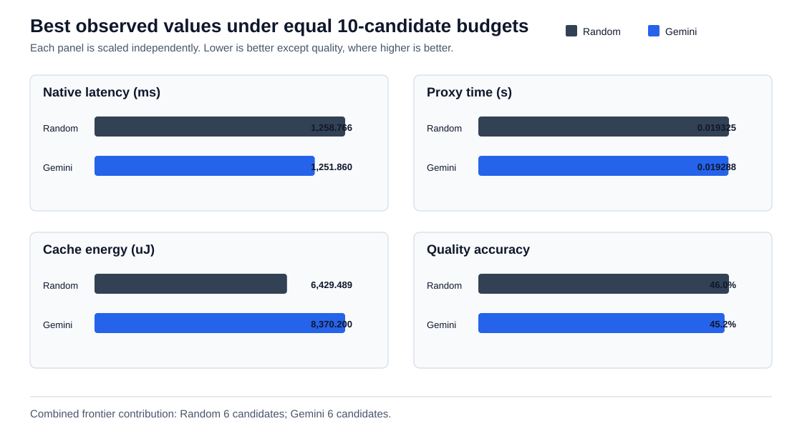

# Gemini versus random: 250-question, 10-candidate comparison

This directory contains the reviewed, machine-neutral evidence summary for the
matched Gemini-guided and seeded-random CHIA campaigns executed on 2026-09-22.
Both methods evaluated ten candidates through the same deterministic native
Qwen, gem5 proxy, cache-energy, quality, record, and Pareto pipeline.

## Result

**There is no single overall winner under this 10-candidate budget.** Each
method contributes six candidates to the combined 12-candidate Pareto frontier.
Gemini found the best observed native latency and proxy time. Random found the
best observed quality and cache dynamic energy. The result supports a
complementary-tradeoffs conclusion rather than a claim that Gemini or random
universally outperformed the other.

| Best observed objective | Random | Gemini | Better observed method |
| --- | ---: | ---: | --- |
| Native Qwen latency | 1258.766 ms | 1251.860 ms | Gemini (0.55% lower) |
| gem5 proxy simulated time | 0.019325 s | 0.019288 s | Gemini (0.19% lower) |
| Estimated cache dynamic energy | 6429.489 uJ | 8370.200 uJ | Random (23.19% lower) |
| Exact option-text accuracy | 46.0% | 45.2% | Random (0.8 percentage points higher) |

Random dominated four of the ten Gemini candidates, while Gemini dominated two
of the ten random candidates. This is a useful secondary set-coverage result,
but it does not override the equal combined-frontier contribution or the split
objective winners. Hypervolume was not used to force a winner because its
ranking changed with the chosen reference point.

## Campaign integrity

| Check | Random | Gemini |
| --- | ---: | ---: |
| Completed candidates | 10/10 | 10/10 |
| Stop reason | `iteration_limit` | `iteration_limit` |
| Stored frontier members | 6 | 6 |
| Combined-frontier contribution | 6 | 6 |
| Server manifest files checked | 227 | 228 |
| Manifest failures | 0 | 0 |
| Repository completed-record validation | 10/10 passed | 10/10 passed |
| Proposal failures | 0 | 0 |
| Campaign wall time | 9835.876 s | 9173.489 s |

All 20 candidate IDs matched their canonical payloads, all objective values
were finite, every record was feasible and complete, comparison groups were
identical, and the two stored Pareto frontiers exactly matched independent
recomputation. Every member of each per-method frontier remained on the
combined frontier.

Gemini made ten accepted requests with no duplicate, malformed, rejected,
fallback, or retry events. It used 32,061 tokens and recorded an estimated cost
of USD 0.00971025. This is an estimator output, not verified live billing.

## Experimental equivalence and provenance qualification

The model SHA, dataset and reference hashes, design-space hash, quality method,
runtime versions, environment, candidate budget, stopping rules, proxy,
energy estimator, evaluator, and measurement repetitions match.

The campaign Git commits differ:

- Random: `12e50b424724efdc92f554db11f820679d227b2e`
- Gemini: `bf4ae62791678e3eb452cff92cc9c436829148ee`

The only recorded runtime source-hash difference is
`src/orchestration/gemini_api.py`. The later Gemini commit changed its proposer
prompt from three-objective guidance to the declared four-objective Pareto
guidance. All deterministic validation, native evaluation, gem5, energy,
evaluation, persistence, and Pareto source hashes are identical. This makes the
observed comparison technically interpretable, because the differing file is
the method-specific Gemini proposer, but the report must disclose that the two
campaigns did not execute from one identical Git commit.

## Best observed candidates

- **Native latency:** Gemini iteration 3, candidate `15fe705f...`, at
  1251.860 ms.
- **Proxy time:** Gemini iteration 2, candidate `69f8f3fc...`, at
  0.019288 seconds.
- **Cache dynamic energy:** random iteration 8, candidate `a8aece3a...`, at
  6429.489 uJ.
- **Quality:** random iteration 2, candidate `21b26804...`, at
  46.0% exact option-text accuracy.

There is no candidate that minimizes all four objectives. Selection therefore
requires an application preference or constraint; the project does not create
an arbitrary weighted score.

## Measurement scope

Quality is exact option-text accuracy over 250 team-authored, OpenStax-aligned
questions. It is not a general factual-correctness metric. Native latency is a
single measurement per question, so small differences should not be treated as
statistically conclusive without repetition.

gem5 evaluates the packed-Q4 14/2/64 attention proxy. It does not simulate the
full Qwen model and does not establish absolute full-model latency.

Energy is estimated dynamic cache-access energy for two L1 instruction caches,
two L1 data caches, and one shared L2 cache. It excludes core logic, DRAM,
interconnect, TLBs, and static or leakage energy.

## Claim boundary

This is one seeded random campaign and one Gemini campaign with ten candidates
per method. It identifies best observed candidates and a Pareto frontier under
that budget. It does not establish a global optimum or statistical superiority.
Repeated matched campaigns with multiple random seeds are required for a
stronger method-level claim.

## Files

- `campaign-audit.json`: validation, provenance comparison, descriptive metrics,
  dominance coverage, best observed values, and the conclusion.
- `candidates.csv`: all 20 candidate knobs, objectives, and frontier membership.
- `combined-pareto.json`: independently computed combined frontier.
- `random-pareto.json` and `gemini-pareto.json`: runtime-produced frontiers.
- `random-summary.json` and `gemini-summary.json`: sanitized campaign summaries.
- `random-provenance.json` and `gemini-provenance.json`: sanitized provenance.
- `random-metadata.json`: seeded-random proposal order.
- `gemini-usage.json` and `gemini-proposals.jsonl`: Gemini accounting and proposals.
- `objective-comparison.svg`: best observed objective comparison.
- `raw-evidence.sha256`: digest of the reviewed compact evidence archive.
- `SHA256SUMS`: digests of the curated files in this directory.
