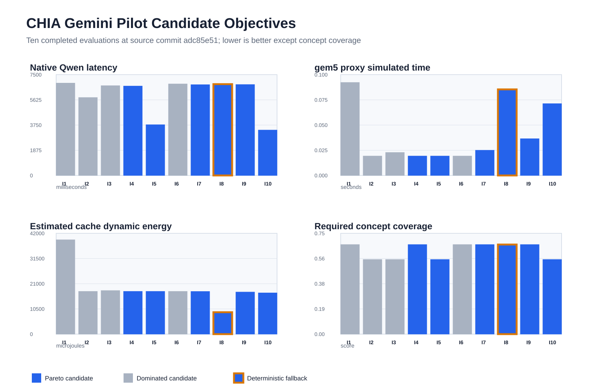

# Ten candidate Gemini pilot

This directory contains the reviewed, machine-neutral evidence summary for the
`final-burst-gemini` campaign executed on 2026-09-21. It is a successful
Gemini-guided pilot, not the final Gemini-versus-random comparison.

## Campaign outcome

| Field | Observed value |
| --- | --- |
| Source Git commit | `adc85e51d9684921830e6b6bb1cbcdaeeb2c3ebc` |
| Branch | `release/final-burst` |
| Campaign state | `completed` |
| Stop reason | `iteration_limit` |
| Evaluated candidates | 10 |
| Completed candidates | 10 |
| Gemini-selected candidates | 9 |
| Deterministic fallback candidates | 1 |
| Observed Pareto candidates | 6 |
| Campaign wall time | 9468.836 seconds |
| Gemini requests | 10 |
| Rejected duplicate proposals | 1 |
| Malformed responses | 0 |
| Gemini tokens | 32,937 |
| Estimated Gemini cost | USD 0.00993925 |

The cost is an estimate from the reviewed compute policy. It is not verified
live billing.

Gemini repeated candidate `4f3a2df8...` on its eighth request. Deterministic
validation rejected the duplicate without evaluating it, and the campaign used
candidate `b900e503...` from the deterministic fallback sequence. The ten
completed evaluations therefore comprise nine accepted Gemini proposals and
one fallback.



Blue bars identify candidates on the observed four-objective Pareto frontier.
Gray bars identify dominated candidates. The orange outline marks the
deterministic fallback at iteration 8. Lower values are preferred for native
latency, proxy simulated time, cache dynamic energy, and quality loss. The
figure shows quality rather than quality loss, so higher is preferred in the
bottom-right panel.

## Best observed candidates

| Observation | Iteration | Candidate | Source | Native latency ms | Proxy seconds | Cache energy uJ | Quality |
| --- | ---: | --- | --- | ---: | ---: | ---: | ---: |
| Lowest native latency | 10 | `93e94993...` | Gemini | 3382.129 | 0.071254 | 17192.420 | 0.556 |
| Lowest proxy time with higher quality | 4 | `4f3a2df8...` | Gemini | 6655.402 | 0.019288 | 17827.216 | 0.667 |
| Low native and proxy time | 5 | `27aa3f20...` | Gemini | 3778.099 | 0.019288 | 17827.216 | 0.556 |
| Lowest cache dynamic energy | 8 | `b900e503...` | Fallback | 6795.596 | 0.085400 | 9136.519 | 0.667 |

There is no single candidate that minimizes every objective. The six observed
Pareto candidates are iterations 4, 5, 7, 8, 9, and 10. The Pareto set stored
by the campaign matches an independent recomputation from the ten completed
records.

## Interpretation

Gemini moved from a `RiscvTimingSimpleCPU` proposal to predominantly
`RiscvO3CPU` proposals with issue width 4, a 64 KiB L1D, and a 1024 KiB L2.
It explored output-token limits and frequencies but did not broadly sample the
available cache capacities. A matched random campaign is required to determine
whether this concentration improved search efficiency.

The 4 GHz O3 candidates reached the minimum observed proxy time. Reducing the
frequency produced a large proxy-time penalty and only a modest cache dynamic
energy reduction for the otherwise similar O3 configurations. The fallback
configuration obtained the minimum energy by using a narrower issue width and
lower cache associativity, while accepting slower proxy execution.

The `max_output_tokens: 128` candidates had the two lowest native latencies,
but both had the lower observed quality score. This is an observed pilot
tradeoff, not a general model-quality conclusion.

## Measurement scope

Native latency is measured from local llama.cpp HTTP round trips for three
OpenStax questions with one repetition per question. The quality score is
deterministic required-concept coverage. It is not human judgment and does not
establish factual correctness.

gem5 executes the packed-Q4 14/2/64 attention proxy. This proxy represents
Qwen attention geometry for comparative hardware design-space exploration.
gem5 does not simulate the complete Qwen model, and the proxy result is not an
absolute full-model latency prediction.

Energy is estimated dynamic cache-access energy for two L1 instruction caches,
two L1 data caches, and one shared L2 cache. It excludes processor-core logic,
DRAM, interconnect, TLBs, static or leakage energy, and native Qwen energy.

## Integrity

All ten candidate records passed the repository's completed-record validator.
Candidate IDs were unique, every comparison group matched, and the stored and
recomputed Pareto frontiers agreed. On the execution server, every file listed
in the original `MANIFEST.sha256` passed `sha256sum --check`.

The reviewed compact raw-evidence archive has SHA-256:

```text
c4295cae0094d741feaf7fa900c130bcc74f569a5eb8a118606c53d747e08c2d
```

The archive itself is not committed because it contains machine-specific paths,
native model responses, and generated simulator working files. The repository
retains the reviewed metrics, proposal ledger, usage ledger, Pareto records,
public provenance, and archive digest.

## Files

- `campaign-audit.json`: derived campaign checks, best-observed values, and all candidate rows.
- `candidates.csv`: flat candidate knob and metric table.
- `pareto.json`: campaign-produced Pareto IDs and objective vectors.
- `gemini-usage.json`: authoritative campaign usage ledger.
- `proposals.jsonl`: accepted and rejected Gemini proposal events.
- `provenance.json`: source, model, dataset, design-space, and runtime identities.
- `environment.json`: generic execution environment information.
- `raw-evidence.sha256`: digest of the reviewed compact raw-evidence archive.
- `SHA256SUMS`: digests of the curated files committed in this directory.

## Publication boundary

This evidence supports statements about best observed candidates and the Pareto
frontier under this pilot budget. It does not show that Gemini outperforms
random search and does not establish a global optimum. The next required study
is a ten-candidate seeded-random campaign using the same model, dataset, design
space, proxy, energy estimator, evaluator, resources, candidate budget, and
stopping rules.
