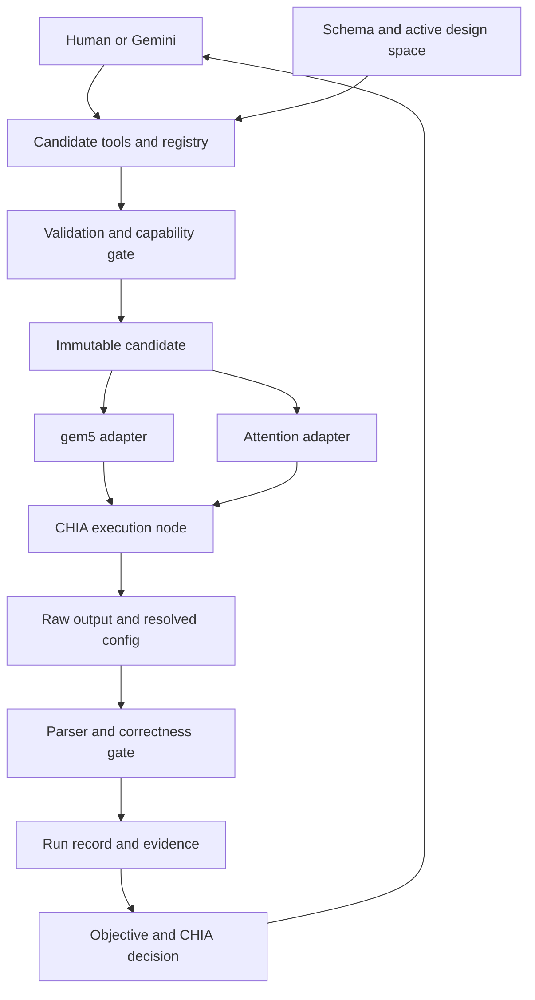

# CHIA Design Parameter and Metric Mapping

## Purpose

Define the canonical interface mapping for CHIA co-design optimization:
1. Trace every candidate configuration field to its backend adapter and implementation.
2. Trace measured outputs back to optimization decisions.
3. Consolidate hardware simulation parameters (gem5 proxy) and application parameters (AI Tutor workload).
4. Preserve strict separation between application-level metrics and simulated hardware metrics.

The [mapping manifest](knob-mapping.manifest.json) records planned project-adapter bindings. PLANNED in the tables describes that integration layer; the separate gem5 runner already consumes hardware fields. No new execution evidence is claimed here.

## Architecture Overview

The Tutor LLM is the application being evaluated. Gemini / CHIA proposes candidates from the active design space. Deterministic validation checks legality before execution. gem5 simulates a representative Attention Kernel proxy.



| Project layer | Responsibility |
| --- | --- |
| Design parameters | Complete candidate dictionary derived from domain schemas and design-space restrictions. |
| Programmatic CHIA edge | Validate -> resolve -> execute -> parse -> build record -> score. |
| Agentic CHIA edge | Gemini uses an allowlisted tool wrapper over the candidate service. |
| Objective decision | Multi-objective scoring: maximize `answer_quality`, minimize `latency_ms` and simulated execution time. |
| Resource placement | Real compute policy places real host jobs; `hardware.cores` describes simulated cores only. |

## Subsystem Boundaries

| Subsystem | Owner | Module / Target |
| --- | --- | --- |
| gem5 simulation | Intern 2 (`yahyafl`) | `src/hardware/runner.py`, `gem5/run_attention_experiment.py` |
| Attention proxy workload | Intern 2 (`yahyafl`) | `gem5/attention_kv.c`, `gem5/extract_metrics.py` |
| AI Tutor workload & RAG | Intern 3 (`sara-alsayyah`) | `src/tutor/runner.py` |
| Evaluation & benchmark | Intern 3 (`sara-alsayyah`) | Held-out OpenStax benchmark (`data/references/openstax.json`) |
| CHIA co-design orchestration | Intern 1 (`admatieh`) | `src/orchestration/experiment.py`, `scripts/run_experiment.py` |
| Architecture & contracts | Lynn (`lynn511`) | `experiment-contracts/` |

---

## Hardware Knob Mapping (gem5 Attention Proxy)

Contracts reside in:
- `experiment-contracts/attention-experiments/attention-experiment.schema.json`
- `experiment-contracts/attention-experiments/attention-design-space.schema.json`
- `experiment-contracts/attention-experiments/baseline.attention.yaml`
- `experiment-contracts/attention-experiments/design-space.yaml`

### Active Hardware Knobs (Search Space)

| Field | Legal Values | Baseline | Classification | Status | Constraints & Semantics |
| --- | --- | --- | --- | --- | --- |
| `hardware.cpu_model` | `RiscvTimingSimpleCPU`, `RiscvO3CPU` | `RiscvO3CPU` | VARIABLE | PLANNED | `RiscvTimingSimpleCPU` requires `issue_width == 1`. |
| `hardware.frequency_ghz` | `1, 2, 3, 4` | `1` | VARIABLE | PLANNED | CPU clock frequency in GHz; clock domain converted to ticks. |
| `hardware.issue_width` | `1, 2, 4` | `2` | VARIABLE | PLANNED | For `RiscvO3CPU`: 1, 2, 4. For `RiscvTimingSimpleCPU`: restricted to 1. |
| `hardware.l1d_cache_kib` | `16, 32, 64` | `64` | VARIABLE | PLANNED | Per-core L1 data cache capacity in KiB. |
| `hardware.l1d_associativity` | `2, 4, 8` | `4` | VARIABLE | PLANNED | Per-core L1 data cache associativity. |
| `hardware.l2_cache_kib` | `256, 512, 1024` | `1024` | VARIABLE | PLANNED | Shared L2 cache capacity in KiB across all simulated cores. |
| `hardware.l2_associativity` | `4, 8, 16` | `8` | VARIABLE | PLANNED | Shared L2 cache associativity. |

### Fixed Hardware Parameters for Current Campaign

| Field | Fixed Value | Status | Rationale / Constraints |
| --- | --- | --- | --- |
| `hardware.cores` | `2` | PLANNED | Fixed at 2 for current campaign; multi-core exploration deferred until workload partitioning is generalized. |
| `hardware.isa` | `RISCV64` | PLANNED | Canonical target architecture: 64-bit RISC-V. |
| `hardware.l1i_cache_kib` | `16` | PLANNED | 16 KiB per-core L1 instruction cache. |
| `hardware.l1i_associativity` | `2` | PLANNED | 2-way set associative L1 instruction cache. |
| `hardware.l1i_latency_cycles` | `2` | PLANNED | Hit latency profile in cycles. |
| `hardware.l1d_latency_cycles` | `2` | PLANNED | Hit latency profile in cycles. |
| `hardware.l2_latency_cycles` | `20` | PLANNED | Shared L2 hit latency in cycles. |
| `hardware.memory_type` | `DDR3_1600_8x8` | PLANNED | Currently validated DRAM controller model. DDR4 excluded. |
| `hardware.memory_size_mib` | `16` | PLANNED | 16 MiB proxy physical address space in gem5 SE mode. |
| `hardware.simulation_mode` | `SE` | PLANNED | Syscall Emulation mode. |

### Attention Workload Proxy Parameters

| Field | Value | Classification | Constraints |
| --- | --- | --- | --- |
| `software.implementation` | `AttentionKernelQuantizedKV` | FIXED | C implementation in `gem5/attention_kv.c`. |
| `software.kv_format` | `Q4` | FIXED | Q4 packed 4-bit KV cache for the current runner. Historical FP32 evidence is separate; FP16 and Q8 remain deferred. |
| `software.threads` | `2` | FIXED | Workload threads for attention kernel proxy (independent of native tutor 4 threads). |
| `workload.context_tokens` | `512` | EVALUATION AXIS | Evaluation axis (`128, 256, 512`); compare within matched conditions. |
| `workload.query_heads` | `4` | FIXED | GQA configuration. |
| `workload.kv_heads` | `2` | FIXED | GQA configuration (4 query heads : 2 KV heads). |
| `workload.head_dimension` | `32` | FIXED | Vector dimension per head. |
| `workload.layers` | `1` | FIXED | Proxy layer count. |
| `measurement.repetitions` | `10` | FIXED | 10 measured repetitions for Q4 campaign. |
| `measurement.warmup_runs` | `0` | FIXED | 0 warmup runs. |
| `measurement.max_simulation_instructions` | `null` | RUN CONTROL | Unbounded simulation by default. |

---

## AI Tutor Software Baseline & Search Space

Contracts reside in:
- `experiment-contracts/ai-tutor-config/ai-tutor.schema.json`
- `experiment-contracts/ai-tutor-config/example.ai-tutor.yaml`
- `experiment-contracts/ai-tutor-config/design-space.yaml`
- `experiment-contracts/ai-tutor-config/ai-tutor-design-space.schema.json`

### User-Supplied Software Baseline

| Field | Baseline Value | Unit | Status | Owner | Constraints & Unresolved Items |
| --- | --- | --- | --- | --- | --- |
| `software.model` | `Llama 3.2 1B Instruct` | - | PLANNED | Intern 3 | User-supplied baseline. Exact GGUF/model artifact path unresolved. |
| `software.quantization` | `Q4_K_M` | - | PLANNED | Intern 3 | Model-weight quantization; distinct from attention proxy KV format Q4. |
| `software.backend` | `llama.cpp / CPU` | - | PLANNED | Intern 3 | Local CPU execution; old Ollama assumptions replaced. |
| `software.cpu_threads` | `4` | threads | PLANNED | Intern 3 | Native host worker threads. Independent of gem5 proxy threads (`2`). |
| `software.batch_size` | `1` | - | PLANNED | Intern 3 | Runtime mapping pending; not automatically mapped to llama.cpp `n_batch`. |
| `software.temperature` | `0.0` | unitless | PLANNED | Intern 3 | Sampling temperature for answer generation. Search space pending. |
| `software.max_output_tokens` | `384` | tokens | PLANNED | Intern 3 | Response token generation limit. |
| `software.embedding_model` | `MiniLM-L6-dot-v1` | - | PLANNED | Intern 3 | Exact repository identifier unresolved. |
| `software.embedding_dimension` | `384` | dimensions | PLANNED | Intern 3 | Embedding vector dimensionality. |
| `software.retrieval_method` | `Semantic similarity` | - | PLANNED | Intern 3 | Specific distance metric (cosine vs dot product) unresolved. |
| `software.top_k` | `2` | passages | PLANNED | Intern 3 | Number of retrieved context chunks. |
| `software.chunk_size` | `1500` | characters | PLANNED | Intern 3 | Measured in **CHARACTERS**, not tokens. |
| `software.chunk_overlap` | `200` | characters | PLANNED | Intern 3 | Measured in **CHARACTERS**, not tokens. Must be `< chunk_size`. |
| `software.runtime_ready` | `false` | boolean | PLANNED | Intern 3 | Schema-valid while execution readiness remains false pending artifacts. |

### Software Search Space Status

The initial software baseline is **fixed for initial comparison**. Software search space exploration (ranges, tunable status) is recorded as **pending definition** in `experiment-contracts/ai-tutor-config/design-space.yaml`.

### Evaluation Isolation Guardrail

- Reference answers from OpenStax (`data/references/openstax.json`) are used solely for offline answer evaluation.
- `evaluation.reference_source: "openstax"`
- `evaluation.reference_visible_to_model: false`
- Reference answers must NEVER be provided as model input or ingested into the RAG corpus.

---

## Metrics and Optimization Objectives

Intended reverse path: execution output -> parsing & validation -> run record -> multi-objective feedback. The complete integration remains pending; see [metric naming differences](configuration.md#metric-naming-at-the-integration-boundary).

### Metric Separation

| Metric Category | Fields | Role |
| --- | --- | --- |
| Application Quality | `answer_quality` | Evaluated against held-out references; direction: **maximize**. |
| Application Latency | `latency_ms` | Real end-to-end wall-clock latency on host; direction: **minimize**. |
| Simulated Time | `simulated_seconds`, `sim_ticks` | Simulated cycle-accurate proxy time from gem5; direction: **minimize**. |
| Microarchitectural Diagnostics | `cycles_per_core`, `ipc_per_core`, `cpi_per_core`, cache miss rates | Diagnostic profiling; explains hardware behavior. |
| Correctness Evidence | Workload validation output | Successful execution and correctness need evidence; the metric extractor does not emit `checksum` or `passed` fields. |

> [!IMPORTANT]
> Real Tutor application latency (`latency_ms`) is distinct from simulated hardware execution time (`simulated_seconds` / `sim_ticks`). Never conflate host execution time with gem5 simulated time.

---

## Validation Entrypoint

All contracts, examples, and semantic policies are validated using the single documented validation entrypoint:

```bash
python scripts/validate_configs.py
```

This verifies:
1. Structural schema validity for all JSON schemas.
2. Composed references and local resolution without network access.
3. Every maintained YAML example and search space document.
4. Semantic rules (burst permissions, TimingSimpleCPU constraints, thread separation, character units).
5. Negative test cases (rejection of illegal values, invalid CPU widths, invalid runtimes).
